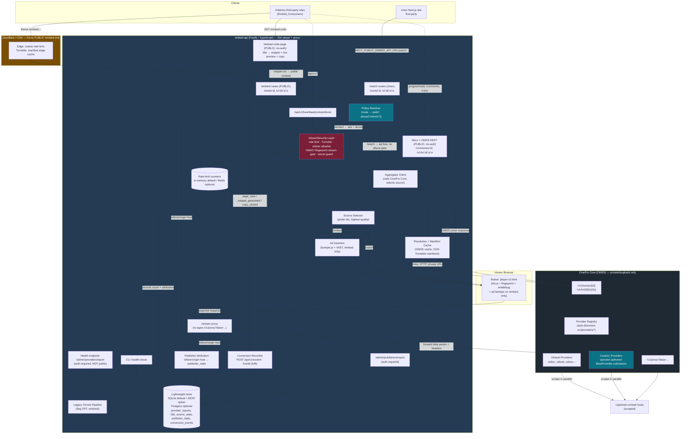
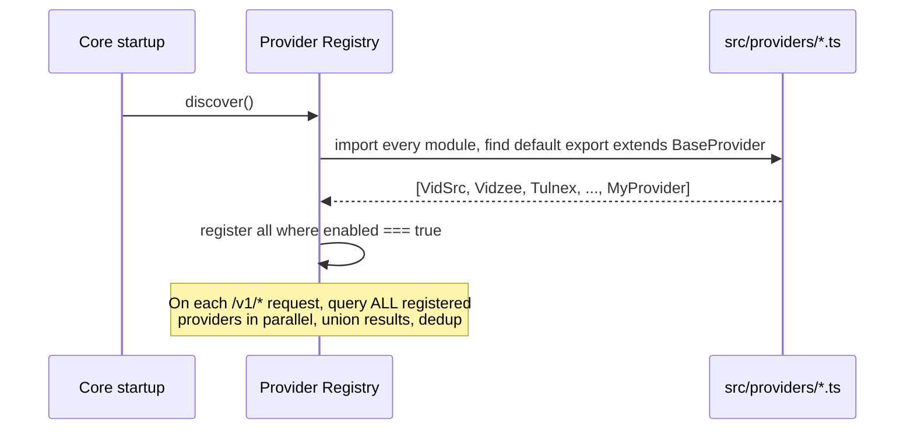

# Design Document

## Overview

This design turns `embed-api` into a **thin player + proxy layer** in front of **CinePro Core** (the OMSS-compliant scraping engine, `ghcr.io/cinepro-org/core:latest`), and now opens it as a **public, vidsrc.to-style embed PROVIDER service** with **two delivery surfaces on one backend**. The single most important objective driving every decision below is the **primary goal**:

> **Maximize the number of working, scraped embed Sources for each title, and make adding NEW providers cheap so that count keeps growing over time.**

Everything else — player rendering, proxying, the two surfaces, retiring the torrent pipeline — exists to *serve* those aggregated sources to viewers. The design is therefore organized around four load-bearing capabilities:

1. **Source Aggregation (Req 1):** CinePro Core queries *every* registered provider in parallel for a title and returns the **union** of sources (not first-match), deduplicated by stream identity, with per-title source-count and provider attribution recorded. New providers are authored as `BaseProvider` subclasses dropped into CinePro Core's `src/providers/` directory and auto-discovered at startup — this is the primary growth lever.
2. **Provider Health Testing & Pruning (Req 2, 3):** A `Health_Check` component runs registered providers across a configurable test-title set, classifies each as healthy / unhealthy / unknown with reasons, produces a persisted `Provider_Report`, exposes it via an authenticated HTTP endpoint and a CLI command, and feeds a config switch that excludes unhealthy providers from aggregation.
3. **Dual-surface serving with per-route policy (Req 4, 11, 12):** both surfaces resolve titles through the *same* Aggregator, source selector, player, fingerprint, and anti-debug, then a single **policy-resolution layer keyed by route** decides monetization and abuse posture:
   - **Public embed surface** — `/embed/movie/:id` and `/embed/tv/:id/:s/:e` are the **PUBLIC, third-party-iframable interface** (vidsrc.to-style). It is **AD-SUPPORTED** (existing `ads/bumper.js` + `AD_VAST_URL` + `AD_BUMPER_ENABLED`), sits **behind Cloudflare/CDN**, and is **abuse-controlled** (rate limiting, Turnstile, hotlink allowlist, HMAC + fingerprint stream gating).
   - **Cinex consumer surface** — `/watch/movie/:id` and `/watch/tv/:id/:s/:e` serve the first-party `cinex` site and stay **AD-FREE and unchanged**.
4. **Public-scale economics (Req 13, 14, 15):** an abuse/security layer and a CDN-frontable manifest-caching layer keep the public surface cheap and safe on a low-resource VPS, with graceful degradation that never regresses the cinex `/watch` path.

A secondary goal updates `cinex/src/utils/players.ts` to drop the ~16 `ads: true` iframe entries and rely on the single ad-free `embed-api` slot, while preserving watch-history sync. A supporting goal feature-flags-off (but keeps) the legacy torrent/Telegram pipeline.

> **Surface vocabulary used throughout:** "Public_Embed" = the `/embed/*` routes (ad-supported, public, abuse-controlled); "Cinex surface" = the `/watch/*` routes (ad-free, first-party). The blanket "ad-free" framing from the prior revision now applies **only** to `/watch` and is not regressed (Req 11.5, 12.3).

### Source/build reality (important constraint that shapes this design)

The `embed-api` directory on disk contains **only the compiled `dist/` output and an `.env` file** — there is no TypeScript source, no `package.json`, and `dist/player/player-v2.html` (referenced by `dist/routes/embed.js` as `../player/player-v2.html`) is **not present** in the tree. This means:

- The design specifies behavior against the **TypeScript source layer** (`src/`) that must be **reconstructed or recovered** before implementation. Implementation tasks must restore the buildable TS project (and the `player-v2.html` template) first; editing `dist/*.js` directly is a stopgap, not the target.
- All file paths below (`src/aggregator/...`, `src/routes/watch.ts`, etc.) describe the intended source tree. Where only `dist` exists today, the corresponding `.js` is the current artifact.

This reconstruction risk is tracked in the **Constraints & Risks** section.

### Key existing facts the design builds on (verified by reading the code)

- `dist/routes/embed.js` already renders the player by string-replacing `{{FINGERPRINT_SCRIPT}}`, `{{ANTIDEBUG_SCRIPT}}`, and `'{{HLS_SOURCE}}'` into the template, has a `buildUnavailableHtml()` "Content Unavailable" page, and a `sendPlayerResponse()` helper that sets `X-Frame-Options: ALLOWALL` and a permissive CSP so the player can be iframed by arbitrary sites. This permissive iframing is now a **deliberate, documented trade-off for the public `/embed` surface** (Req 11.3) — see **Security of the public iframe** — and must **not** be extended to `/admin` or tokened routes.
- `/embed/...` is the **existing, now-PUBLIC surface** (Req 11.1); it already exists and is the ad-supported, abuse-controlled interface third parties iframe. `/watch/...` is the **new first-party cinex surface** (Req 4) and does **not** exist yet — it must be added and kept ad-free. Both share the player primitives above; only the **policy layer** (ads / abuse controls) differs by route.
- `ads/bumper.js`, `AD_VAST_URL`, and `AD_BUMPER_ENABLED` already exist in `embed-api` — they are the ad infrastructure applied to the Public_Embed surface only (Req 12).
- `TURNSTILE_SITE_KEY` / `TURNSTILE_SECRET` and `HMAC_SECRET` (default `change-this-secret-in-production`) already exist in `.env` — they back the public bot-check and the stream-token / production-secret guard (Req 13).
- `dist/pipeline/catalog.js#resolveContent` is the legacy resolver (cache → Telegram → torrent → Real-Debrid). It already short-circuits torrent work when `TORRENT_PIPELINE_ENABLED !== "true"`. This is the subsystem to feature-flag off (Req 9).
- `dist/providers/index.js` is a legacy static list of *ad-laden iframe* provider URLs. It is superseded by CinePro Core aggregation and is not the provider model for this feature.
- `dist/config.js` already reads `TMDB_API_KEY` and `TORRENT_PIPELINE_ENABLED`; CinePro Core base URL / timeout / health auth keys must be added.
- `dist/db/index.js` uses Postgres (`pg.Pool`) with an `initDb()` migration block — the natural home for a `provider_reports` table.
- `cinex/src/utils/players.ts` already has a `cineproMoviePlayers`/`cineproTvPlayers` ad-free slot gated on `NEXT_PUBLIC_EMBED_API_URL`; the work is to keep that and remove the `ads: true` entries.
- `cinex/src/hooks/useVidlinkPlayer.ts` hard-codes `event.origin !== "https://vidlink.pro"` for `postMessage` history sync — this must become the self-hosted player origin for history to work with the ad-free slot.

## Architecture

### Component diagram



The security boundary is still that **CinePro Core is reachable only on a private/loopback address** (e.g. `http://127.0.0.1:8080`), and the browser only ever talks to `embed-api`. Two additions for the public surface: **Cloudflare/CDN fronts the public `/embed` routes** (coarse rate limiting, Turnstile, and manifest edge-caching happen at the edge), and the **Abuse/Security Layer** sits between the public routes and the Aggregator. The cinex `/watch` routes pass through the Policy Resolver but skip the ad and abuse-gate branches.

### Surfaces & Policy

A single **Policy Resolver** (`src/policy/resolve.ts`) maps an incoming route to a `SurfacePolicy`. It is the one place that decides "ads or not / abuse controls or not", so the two surfaces cannot drift apart or accidentally swap policies.

```ts
type Surface = "public_embed" | "cinex_watch";

interface SurfacePolicy {
  surface: Surface;
  adSupported: boolean;     // true ⇔ public_embed (and gated again by AD_BUMPER_ENABLED at render)
  abuseControls: boolean;   // true ⇔ public_embed (rate limit + Turnstile + allowlist + stream gate)
  cdnCacheManifests: boolean; // true ⇔ public_embed (edge-cacheable manifests)
}

// Pure, total mapping (Property 14): /embed/* → public_embed; /watch/* → cinex_watch.
function resolvePolicy(routePrefix: "/embed" | "/watch"): SurfacePolicy;
```

| Concern | `/embed/*` (Public_Embed) | `/watch/*` (Cinex) |
|---------|---------------------------|--------------------|
| Audience | Arbitrary third-party iframes | First-party cinex only |
| Ads | **Ad-supported** (bumper + VAST, gated by `AD_BUMPER_ENABLED`) | **Ad-free**, always |
| In front | Cloudflare/CDN | direct (behind existing reverse proxy) |
| Rate limit / Turnstile / referer allowlist | **Yes** (Req 13) | No |
| HMAC + fingerprint stream gate | **Yes** before token issuance | existing fingerprint/anti-debug only |
| Manifest CDN caching | **Yes** (Req 14.2) | not required |
| Aggregator / selector / player / proxy | **Shared** (Req 11.4) | **Shared** (Req 11.4) |

Both surfaces call the *same* Aggregator, Source Selector, player template, and `/stream` proxy (Req 11.4); only the policy-driven wrapper differs. This guarantees Req 11.5 / 12.3 / 15.2: enabling or stressing the public surface cannot turn `/watch` into an ad-supported or degraded path, because `/watch` never enters the ad or abuse branches.

### Request flow: `/embed/movie/:id` (public, ad-supported)

```mermaid
sequenceDiagram
    participant TP as Third-party iframe
    participant CF as Cloudflare/CDN
    participant E as embed-api /embed
    participant AB as Abuse/Security Layer
    participant K as Cache
    participant C as CinePro Core

    TP->>CF: GET /embed/movie/603 (Referer: site.tld)
    CF->>CF: edge rate-limit + manifest cache check
    CF->>E: forward (cache miss / HTML)
    E->>AB: resolvePolicy("/embed") → {ads, abuseControls}
    AB->>AB: per-IP/referer rate limit (Req 13.1)
    AB->>AB: referer allowlist if configured (Req 13.5)
    alt Turnstile enabled and not yet verified
        AB-->>TP: challenge page (Turnstile) before token issuance (Req 13.2)
    end
    AB->>K: getOrResolve(603, movie)
    K->>C: GET /v1/movies/603 (miss only; 10s timeout)
    C-->>K: OMSS union (cached for expiresAt window, Req 14.1/14.5)
    K-->>E: OMSS sources[]
    E->>E: select source; rewrite url → /stream?data=SIGNED(HMAC)
    E->>E: apply ad bumper + VAST (AD_BUMPER_ENABLED) (Req 12.1/12.2)
    E-->>TP: 200 player-v2.html (ad bumper) + Cache-Control: manifest cacheable
    Note over TP,E: /stream requires valid HMAC Session_Token + fingerprint (Req 13.3);<br/>segments + tokens are never cacheable (Req 14.3)
    Note over TP,E: rate-limited → "rate-limited" response, not a broken player (Req 15.3);<br/>no sources / Core down → "Content Unavailable" (Req 15.1)
```

The TV flow is identical except `embed-api` calls `GET /v1/tv/{id}/{season}/{episode}`. The Cinex `/watch` flow below is the same resolution path **without** the Cloudflare edge, the abuse layer, or the ad bumper.

### Request flow: `/watch/movie/:id` (cinex, ad-free)

```mermaid
sequenceDiagram
    participant B as Browser (iframe)
    participant E as embed-api /watch
    participant C as CinePro Core
    participant U as Upstream hosts

    B->>E: GET /watch/movie/603
    E->>C: GET /v1/movies/603  (timeout 10s)
    C->>U: scrape ALL providers in parallel
    U-->>C: raw streams (union)
    C-->>E: OMSS { responseId, expiresAt, sources[], subtitles[] }
    Note over E: dedup already done by Core;<br/>embed-api selects source
    E->>E: select: prefer hls → highest quality
    alt expiresAt in the past
        E->>C: GET /v1/movies/603 (refresh)
        C-->>E: fresh OMSS
    end
    E->>E: rewrite source.url (/v1/proxy?data=X) → /stream?data=SIGNED
    E->>E: record count + provider attribution (DB)
    E-->>B: 200 player-v2.html (HLS_SOURCE = /stream?data=SIGNED)
    B->>E: GET /stream?data=SIGNED (+ ranges/segments)
    E->>C: GET /v1/proxy?data=X (forward required headers)
    C->>U: fetch segment
    U-->>C: bytes
    C-->>E: bytes
    E-->>B: bytes (Core host never exposed)
    Note over B,E: If no sources OR Core fails/timeout → "Content Unavailable" page
```

The TV flow is identical except `embed-api` calls `GET /v1/tv/{id}/{season}/{episode}` and passes `season`/`episode` through exactly as received (Req 4.2, 4.3).

### Layering

`embed-api` stays thin. It owns: routing, **policy resolution (route → surface policy)**, **public abuse/security controls**, **ad insertion on the public surface**, source selection, **OMSS/manifest caching**, proxy re-signing, health orchestration/reporting, attribution persistence, and the player template. It owns **no scraping logic** — all scraping, the union across providers, and dedup live in CinePro Core. New-provider authoring therefore happens **inside CinePro Core**, which is exactly where the OMSS `BaseProvider` auto-discovery lives. The ad, abuse, and CDN-cache concerns are **per-surface wrappers** around the shared resolution core, never forked copies of it.

## Components and Interfaces

### 1. Aggregator Client (`src/aggregator/client.ts`)

Thin HTTP client to CinePro Core. Responsible for calling the right endpoint, enforcing the 10s timeout, parsing OMSS, and triggering an `expiresAt` refresh.

```ts
interface OmssSource {
  url: string;                       // "/v1/proxy?data=..." (Core-relative)
  type: "hls" | "dash" | "http" | "mp4" | "mkv" | "webm";
  quality?: string;                  // e.g. "1080p", "720p", "auto"
  audioTracks?: { lang: string; label?: string }[];
  provider: { id: string; name: string };
}

interface OmssResponse {
  responseId: string;
  expiresAt: string;                 // ISO-8601
  sources: OmssSource[];
  subtitles?: { lang: string; url: string; label?: string }[];
  diagnostics?: { provider: string; ok: boolean; reason?: string }[];
}

interface AggregatorClient {
  // Req 4.1, 4.2, 4.3, 7.3 (10s timeout), 7.4 (expiresAt refresh)
  getMovieSources(tmdbId: number): Promise<OmssResponse>;
  getTvSources(tmdbId: number, season: number, episode: number): Promise<OmssResponse>;
}
```

Behavior:
- Builds the URL from `config.cineproBaseUrl` (Req 8.1). Never leaks that base into responses.
- Uses an `AbortController` with `config.cineproTimeoutMs` (default 10000) (Req 7.3).
- On non-2xx, network error, or timeout → throws `CoreUnavailableError` (caught by the route → "Content Unavailable" + log, Req 7.2).
- After parsing, if the chosen response's `expiresAt < now`, performs exactly one refresh fetch before returning (Req 7.4).

### 2. Source Selector (`src/aggregator/select.ts`)

Pure function. Implements Req 4.4–4.6 ordering. See pseudocode in **Source-selection algorithm**.

```ts
// Returns the single best source to play, or null if none.
function selectSource(sources: OmssSource[]): OmssSource | null;
```

### 3. Watch & Embed Routes (`src/routes/watch.ts`, `src/routes/embed.ts`)

```ts
// Cinex (ad-free):
// GET /watch/movie/:tmdbId                 (Req 4.1)
// GET /watch/tv/:tmdbId/:season/:episode   (Req 4.2)
// Public (ad-supported, abuse-controlled):
// GET /embed/movie/:tmdbId                 (Req 11.1)
// GET /embed/tv/:tmdbId/:season/:episode   (Req 11.1)
```

Both route groups share the **same orchestration core**; they differ only by the `SurfacePolicy` returned by the Policy Resolver (component 11). Orchestration per request:
0. `policy = resolvePolicy(routePrefix)` — `/embed` → `public_embed`, `/watch` → `cinex_watch` (Req 11.1, 11.2).
1. Validate ids (reuse the `Number()`/`isNaN` guard pattern from `embed.js`).
2. **If `policy.abuseControls`** (public only): run the Abuse/Security Layer gate (rate limit → referer allowlist → Turnstile) *before* resolving; a rejection short-circuits to a rate-limited / challenge response, never a broken player (component 12; Req 13.1, 13.2, 13.5, 15.3).
3. `resolveViaCache(...)` → `OmssResponse` (cache hit, else aggregator with 10s timeout) (component 14; Req 14.1, 14.5).
4. `selectSource(response.sources)`. If `null` or empty → `buildUnavailableHtml()` (Req 7.1, 15.1).
5. Rewrite the selected `source.url` into an `embed-api`-served `/stream?data=...` URL (Req 6.1).
6. Record `{ tmdbId, type, season, episode, count: sources.length, providers: distinct provider ids }` to `title_source_stats` (Req 1.6).
7. Build the player HTML reusing the existing template + fingerprint + anti-debug (Req 4.7). **If `policy.adSupported`** (public only): pass the ad-bumper flag into the template so `ads/bumper.js` + VAST are wired (component 13; Req 12.1, 12.2, 12.4). `/watch` is rendered with the bumper flag **off** (Req 12.3).
8. `sendPlayerResponse(...)` with cache-control headers from the policy: manifests CDN-cacheable on `/embed` (Req 14.2), segments/tokens never cacheable (Req 14.3).

The routes are **feature-flagged**: when `config.aggregatorEnabled` is true (default), they resolve via the aggregator and the legacy pipeline is skipped (Req 9.1, 9.3). The public surface is additionally gated by `config.publicEmbedEnabled`; while it is enabled, the `/watch` path stays ad-free and functional (Req 11.5, 15.2) because it never enters steps 2 or 7's ad branch.

### 4. Stream Proxy (`src/routes/stream.ts`)

```ts
// GET /stream?data=<signed>     (Req 6.1, 6.2, 6.3, 6.4)
```

- `data` reaching the browser is an **`embed-api`-signed token** (HMAC, reusing `protection/hmac.ts` + `config.hmacSecret`) that encodes the original Core `data` parameter and an expiry. The raw Core `data` and the Core host are never exposed. This signed token **is** the `Session_Token` of Req 13.3.
- **Stream-access gate (Req 13.3):** before serving any byte, `/stream` requires a valid HMAC `Session_Token` **and** the existing fingerprint / anti-debug signal. A missing/invalid/expired token or a failed fingerprint → 403, never a partial stream. On the public surface this gate is the enforcement point downstream of the Turnstile bot-check (token issuance only happens after the `/embed` abuse gate passes).
- On request: verify the signature/expiry (reuse the `verifySegmentToken` style from `hls.js`), decode the original Core `data`, then `fetch(`${config.cineproBaseUrl}/v1/proxy?data=${coreData}`)` forwarding any headers CinePro Core requires (Req 6.3), and stream the body back. Supports HTTP range requests for seeking.
- For `hls` playlists, rewrite child segment/variant URIs so they also point back through `/stream?data=...` (keeps every byte flowing through `embed-api`).
- **Cache-control (Req 14.3):** `/stream` responses for **segments and Session_Tokens are always `Cache-Control: no-store`** — they must never be cached by the CDN or browser (tokens are per-session and expiring; segment bytes must not be edge-pinned). Only the (tiny) `.m3u8` **manifest** carries a cacheable header on the public surface (Req 14.2). See the Caching component (14) for the exact header matrix.

#### Proxy mode (`config.proxyMode`) — the dominant cheap-VPS cost lever

Every video byte routed through `/stream` consumes VPS egress and a little CPU. `proxyMode` selects how much of the stream actually transits `embed-api`:

- **`proxy` (default, full correctness):** both the `.m3u8` manifest **and** every segment/variant transit `embed-api`. Host fully hidden, required headers attached, ad-free guaranteed. Cost: full bandwidth on the VPS. This is the mode the security boundary and **Property 7 / Property 13** assume.
- **`playlist-only` (a.k.a. `hybrid`):** only the (tiny) `.m3u8` manifest transits `embed-api`; it is rewritten so **segment URIs point either directly to the upstream stream or to Core**, so the heavy segment bytes bypass `embed-api`. Big bandwidth saving. Trade-off: the upstream/Core host of the *segments* may be exposed to the client, and providers that need per-request header forwarding on segments may break.
- **`redirect` (pure redirect, lightest):** `/stream` 302-redirects the player straight to the upstream/Core URL. Saves the most (no segment or manifest proxying). Trade-off: **loses host-hiding and the ad-free guarantee** for whatever the client is redirected to; use only for providers known to be clean and header-free.

The route advertises the chosen mode in selection/attribution logging so the operator can correlate breakage with mode. **Recommendation:** default to `proxy` for guaranteed correctness, then drop to the lightest mode (`playlist-only`, and only `redirect` where safe) that still plays for your provider set to cut egress. See **Resource Footprint & Cheap-VPS Tuning**.

### 5. Health Check (`src/health/checker.ts`)

```ts
type HealthStatus = "healthy" | "unhealthy" | "unknown";

interface ProviderTitleResult {
  providerId: string;
  tmdbId: number;
  type: "movie" | "tv";
  season?: number; episode?: number;
  working: boolean;          // a playable Working_Source was produced
  reason?: string;           // present when not working
}

interface ProviderHealth {
  providerId: string;
  providerName: string;
  status: HealthStatus;       // exactly one (Req 2.2)
  workingTitleCount: number;  // # test titles yielding a Working_Source (Req 2.4)
  testedTitleCount: number;
  checkedAt: string;          // ISO-8601 (Req 2.4)
  failureReason?: string;     // present iff status === "unhealthy" (Req 2.5)
}

interface ProviderReport {
  generatedAt: string;
  testTitles: TitleRef[];
  providers: ProviderHealth[];
}

interface HealthChecker {
  // Req 2.1, 2.3: run across configured test titles for all providers
  runHealthChecks(titles: TitleRef[]): Promise<ProviderReport>;
  // Req 2.1: single provider/title playability decision
  checkProviderTitle(providerId: string, title: TitleRef): Promise<ProviderTitleResult>;
}
```

Classification rule (total function — every provider gets exactly one status, Req 2.2):
- **healthy**: `workingTitleCount > 0` (the provider produced at least one Working_Source across the test set).
- **unhealthy**: `testedTitleCount > 0` and `workingTitleCount === 0` (it was reachable/attempted but produced nothing playable). `failureReason` set to the dominant failure reason.
- **unknown**: `testedTitleCount === 0` (could not be tested — e.g. Core unreachable, provider disabled mid-run, no test titles applicable).

"Playable" decision for a single source: a `HEAD`/range `GET` through the proxy path returns 2xx and (for `hls`) the body parses as a valid manifest with at least one segment/variant. Network/timeout/non-2xx → `working: false` with the reason recorded.

### 6. Health Report Store (`src/health/store.ts`)

Persists the latest `ProviderReport`. **Decision (cheap-VPS default): persist to a lightweight local store — SQLite file (default) or a flat JSON file** selected by `config.storageBackend`. Postgres is **optional** and used only when explicitly selected (e.g. an existing multi-node deployment). Rationale: running Postgres alongside Core + embed-api on a 1-2 GB VPS wastes RAM for a workload that is single-node and very low write volume (a report per cron run, a row per watch). See **Resource Footprint & Cheap-VPS Tuning** for the full trade-off.

Backend selection (via `STORAGE_BACKEND`):
- `sqlite` (default): a single file at `config.sqlitePath` (e.g. `./data/embed.db`). Tiny footprint, no separate server process, supports the same history/queries as Postgres for one node.
- `json`: append/replace a JSON file at `config.healthReportPath`. Zero dependencies; best for the smallest deployments and read-mostly access. Trade-off: no concurrent-writer safety and no indexed queries — acceptable at this write volume.
- `postgres`: only when `STORAGE_BACKEND=postgres` (and `DATABASE_URL` set). Use when Postgres is already present or multi-node history is needed. Trade-off: a full DB server's RAM/CPU cost.

The `HealthReportStore` and the attribution writer are written against a small storage interface so the three backends are interchangeable; no caller depends on Postgres-specific behavior.

```ts
interface HealthReportStore {
  saveReport(report: ProviderReport): Promise<void>;
  getLatestReport(): Promise<ProviderReport | null>;   // Req 3.1
}
```

### 7. Health HTTP Endpoint (`src/routes/admin.ts`)

```ts
// GET /admin/providers/report   (Req 3.1, 3.2)
```
Returns the latest `ProviderReport` as JSON. **Requires authentication** (Req 3.2): a bearer token compared against `config.healthAuthToken` in constant time; missing/wrong token → 401. This route is exempt from the public CORS allowance and is not advertised to cinex.

### 8. Health CLI (`src/cli/health.ts`)

```bash
node dist/cli/health.js --titles ./test-titles.json   # Req 3.3
```
Runs `HealthChecker.runHealthChecks(...)`, prints a human-readable table plus machine-readable JSON, and saves via `HealthReportStore`. Exit code non-zero if every provider is unhealthy/unknown (useful in CI/cron).

### 9. Provider Filter (aggregation pruning)

When `config.excludeUnhealthyProviders` is true (Req 2.6), the aggregator passes the set of provider ids classified `unhealthy` in the latest report to CinePro Core as an exclusion list (via Core's provider-filter query/header, e.g. `?exclude=<ids>`), or filters them out of the OMSS response if Core cannot pre-filter. Either way, sources from pruned providers do not reach selection or attribution.

### 10. Legacy Torrent Pipeline (retained, flag-off)

`resolveContent` (`pipeline/catalog.js`) and `processFromTorrent` already gate on `TORRENT_PIPELINE_ENABLED`. The design **keeps the code** (Req 9.4) and ensures the default is `false` (Req 9.2, 9.3). When `aggregatorEnabled` is true, `/watch` never calls the legacy resolver.

### 11. Policy Resolver (`src/policy/resolve.ts`)

The single source of truth for "which surface, which policy". A **pure, total function** of the route prefix, so no handler ever hard-codes "is this ads or not".

```ts
type Surface = "public_embed" | "cinex_watch";
interface SurfacePolicy {
  surface: Surface;
  adSupported: boolean;       // true ⇔ public_embed
  abuseControls: boolean;     // true ⇔ public_embed
  cdnCacheManifests: boolean; // true ⇔ public_embed
}
// Req 11.1, 11.2 — total over the two route prefixes; no other input affects the mapping.
function resolvePolicy(prefix: "/embed" | "/watch"): SurfacePolicy {
  return prefix === "/embed"
    ? { surface: "public_embed", adSupported: true,  abuseControls: true,  cdnCacheManifests: true }
    : { surface: "cinex_watch",  adSupported: false, abuseControls: false, cdnCacheManifests: false };
}
```

The mapping is the basis for **Property 14**: `adSupported` is true *iff* the surface is `public_embed` (`/embed`), and false for `/watch`. Note `adSupported` only marks *eligibility*; actual rendering of the bumper is additionally gated by `AD_BUMPER_ENABLED` (Req 12.4) in the Ad Insertion component.

### 12. Abuse / Security Layer (`src/security/*`)

Applied **only when `policy.abuseControls`** (the public `/embed` surface and the public `/api/v1/*` endpoints). Defense-in-depth: coarse limits are pushed to Cloudflare; app-side limits are the second line. Composed of five gates evaluated in order:

```ts
interface RateLimiter {
  // Pure decision (Property 16) + a stateful counter store behind it.
  check(key: string, now: number): { allowed: boolean; remaining: number; resetAt: number };
}
interface AbuseGate {
  // Returns the first failing control, or null to proceed.
  evaluate(req): null | { kind: "rate_limited" | "turnstile_required" | "forbidden_referer" };
}
```

1. **Per-IP and per-referer rate limiting (Req 13.1).** A fixed-window (or token-bucket) limiter keyed by client identity. The **decision function is pure** — `allowed = count <= threshold` within `window` — and is split from the counter store so it can be property-tested independently (Property 16).
   - **Storage:** `config.rateLimitBackend` selects `memory` (default, cheap-VPS) or `redis` (optional, when present or multi-node). In-memory uses a sweeping `Map<key, {count, windowStart}>`; Redis uses `INCR`+`EXPIRE`. Counters are ephemeral — losing them on restart only resets windows, which is acceptable.
   - **Trade-off (documented):** the **primary** coarse rate limit should live at **Cloudflare** (per-IP, edge, free of app CPU); the app-side limiter is **defense-in-depth** for requests that bypass the edge (direct origin hits) and for per-referer granularity Cloudflare rules may not express. Running app-side limits at full public scale costs CPU/RAM, so keep app thresholds generous and let the edge absorb the bulk. Prefer `memory` on a single cheap VPS; reach for `redis` only when multiple app nodes must share counters.
2. **Referer / domain allowlist (Req 13.5, hotlink protection).** When `config.refererAllowlist` is non-empty, the `Referer`/`Origin` host must match an allowlist entry (exact or suffix match) or the request is refused. Empty allowlist = open (vidsrc.to-style broad embedding, Req 11.3). The match predicate is **pure** (Property 17).
3. **Cloudflare Turnstile bot-check (Req 13.2).** When `config.turnstileEnabled`, a valid Turnstile token (verified server-side via `TURNSTILE_SECRET` against the siteverify endpoint, site key `TURNSTILE_SITE_KEY`) is required **before a stream `Session_Token` is issued** on `/embed`. The bot-check fronts token issuance, not every asset; once verified, playback proceeds. Turnstile challenge can also be served at the Cloudflare edge.
4. **HMAC `Session_Token` + fingerprint stream gate (Req 13.3).** Enforced in the `/stream` proxy (component 4): no token / bad token / failed fingerprint → 403.
5. **`/api/v1/*` protection (Req 13.6).** `/api/v1/heartbeat`, `/api/v1/coins/*`, `/api/v1/referral/*` apply the **same per-IP rate limiter** and **validate the fingerprint** before recording any coin/heartbeat/referral effect. A failed check is rejected with no side effect (no coin credited, no heartbeat recorded).

#### Production secret guard (`src/security/secretGuard.ts`, Req 13.4)

A **startup guard**: if `NODE_ENV === "production"` (or `config.env === "production"`) **and** `HMAC_SECRET === "change-this-secret-in-production"`, the process either **refuses to start** (preferred) or logs a **CRITICAL** security error naming the insecure secret. This is a pure predicate over `(env, secret)` (Property 18) and runs before the server binds a port. Outside production the default is tolerated with a warning (keeps local dev frictionless, matching the existing tolerant config style).

```ts
// Property 18: pure guard decision.
function secretGuardDecision(env: string, secret: string):
  "ok" | "refuse_start" | "critical_log" {
  if (env === "production" && secret === "change-this-secret-in-production")
    return config.refuseStartOnInsecureSecret ? "refuse_start" : "critical_log";
  return "ok";
}
```

### 13. Ad Insertion (`src/ads/insert.ts`, wraps existing `ads/bumper.js`)

Applies the existing ad bumper / VAST to the **Public_Embed player only**. The player template (`player-v2.html`) gains an **ad-bumper flag** substituted at render time (a `{{AD_BUMPER}}` placeholder, mirroring the existing `{{FINGERPRINT_SCRIPT}}` / `{{ANTIDEBUG_SCRIPT}}` substitution), or a dedicated `player-v2.html` variant — either way the decision is made by the route from `policy.adSupported`:

```ts
// Req 12.1, 12.2, 12.3, 12.4 — pure decision over (surface, AD_BUMPER_ENABLED, AD_VAST_URL).
function adConfigFor(policy: SurfacePolicy): { bumper: boolean; vastUrl: string | null } {
  if (!policy.adSupported || !config.adBumperEnabled) return { bumper: false, vastUrl: null };
  return { bumper: true, vastUrl: config.adVastUrl ?? null };
}
```

- `/embed` with `AD_BUMPER_ENABLED=true` → bumper active, using `AD_VAST_URL` as the VAST tag (Req 12.1, 12.2).
- `/embed` with `AD_BUMPER_ENABLED=false` → served **without** ads (Req 12.4).
- `/watch` → **always** no bumper regardless of `AD_BUMPER_ENABLED` (Req 12.3) — `policy.adSupported` is false.
- **CWV (Req 10.4):** the bumper script is loaded **deferred/async** and the VAST request is fired after the player shell paints, so the ad path does not block LCP and keeps INP/CLS stable. The ad layer is additive on the public surface and entirely absent on cinex, so cinex CWV is untouched.

### 14. Resolution + Manifest Cache (`src/cache/*`)

One cache in front of the Aggregator that serves the public scale economically (Req 14.1, 14.5) and a header policy that lets the CDN do the heavy lifting (Req 14.2, 14.3).

```ts
interface ResolutionCache {
  // Keyed by (tmdbId, type, season?, episode?). Honors OMSS expiresAt (Req 14.5).
  getOrResolve(key: TitleKey, resolve: () => Promise<OmssResponse>): Promise<OmssResponse>;
}
```

- **OMSS resolution cache (Req 14.1, 14.5):** a repeated request for the same title within the cache window is served from cache without re-scraping. An entry is valid **while `now < expiresAt`** of the cached OMSS response; once expired it is re-resolved (consistent with the existing `expiresAt` refresh in Req 7.4). Backed by the same coalescing cache described in **Resource Footprint §3** (`AGGREGATOR_CACHE_TTL_MS` bounds how long a still-`expiresAt`-valid entry is reused).
- **Cache-control header matrix (Req 14.2, 14.3)** — the invariant behind **Property 15**:

  | Response | `/embed` (public) | `/watch` (cinex) |
  |----------|-------------------|------------------|
  | Player HTML / `.m3u8` **manifest** | `Cache-Control: public, max-age=<manifestTtl>` (CDN-cacheable, Req 14.2) | `private, no-cache` |
  | Stream **segments** | `Cache-Control: no-store` (Req 14.3) | `no-store` |
  | `Session_Token` / `/stream` token responses | `Cache-Control: no-store` (Req 14.3) | `no-store` |

  The invariant: **manifests may be cacheable; segments and tokens are *never* cacheable** on any surface. Manifest TTL (`config.manifestCacheTtlSec`) is kept short (seconds–minutes) so a re-resolved source is picked up quickly at the edge.
- **CDN integration:** Cloudflare caches the manifest at the edge using the above headers, so repeated public hits for a hot title are served entirely from the edge — no origin scrape, no origin egress for the manifest.
- **Redirect proxy mode is the cheapest public option (Req 14.4):** at public scale, proxying segments (`proxyMode=proxy`) is the dominant egress cost. The recommendation for a public service on a cheap VPS is **playlist-only or `redirect`** so segment bytes leave the VPS entirely (CDN/upstream serves them), reserving full `proxy` for the cinex path or clean providers. See the bandwidth economics in **Resource Footprint §2** and the **public-scale economics** note added there.

## B2B Embed Network (Publisher Distribution)

This section adds the **distribution / adoption / attribution / conversion** layer (Req 16-23) **on top of** the existing serving path. It introduces **no new playback machinery**: the snippet `src`, the live preview, and every programmatic call resolve through the *same* public `/embed/*` routes (component 3), the *same* Source Selector (2), player template (3), `/stream` proxy (4), Ad Insertion (13), Abuse/Security Layer (12), and Resolution Cache (14) already defined above. The components below are **thin additions** — a no-auth code page, a docs/REST facade, an attribution writer, a publisher report, and a passive conversion recorder. The conversion goal is **frictionless Publisher adoption**: land → copy a working iframe → paste, with no signup and no key.

> Surface reuse contract: the B2B layer is a *consumer* of the public surface, never a fork of it. Anything a Publisher embeds is an ordinary `/embed/*` request, so it inherits ads (Req 20 via Property 19), abuse bounds (Req 18 via Property 17), host-hiding (Req 6.4 via Property 7/13), and caching (Req 14) automatically.

### 15. Embed Code Page (`src/routes/embedCode.ts`) — conversion-critical

New public route serving the no-signup, no-key adoption page (Req 16). It is intentionally minimal so the **copy action dominates** (Req 16.8).

```ts
// GET /embed-code            → SSR/static page shell (Req 16.1, 16.7, 16.8)
// (snippet generation is pure + client-side; no server round-trip required to render it)
type ContentType = "movie" | "tv";

interface SnippetInput {
  tmdbId: number;
  type: ContentType;
  season?: number;   // required iff type === "tv"
  episode?: number;  // required iff type === "tv"
  poweredBy?: boolean; // Req 21 — default FALSE; pb= only when explicitly opted in
}

// Pure, total snippet builder (Property 22). Uses the PUBLIC embed base
// (config.embedPublicUrl / PUBLIC_BASE_URL), NOT config.cineproBaseUrl and NOT the Core host.
function buildEmbedSnippet(input: SnippetInput): string;
// → '<iframe src="{PUBLIC_BASE}/embed/movie/603" width="100%" height="100%" allowfullscreen></iframe>'
// → '<iframe src="{PUBLIC_BASE}/embed/tv/1399/1/1" width="100%" height="100%" allowfullscreen></iframe>'
```

Page anatomy (exactly five interactive regions, Req 16.8):
1. **Title selector** — `tmdbId` + type toggle; for `tv`, `season` + `episode` inputs (Req 16.2, 16.3).
2. **Live preview** — an `<iframe>` whose `src` is the generated Public_Embed URL, so the Publisher sees the real ad-supported player before copying (Req 16.4). Preview `src` is byte-identical to the snippet `src`.
3. **Snippet display** — the generated `<iframe>` HTML (read-only textarea/`<code>`).
4. **"Copy embed code" control** — the single primary CTA (Req 16.5). On activation: `await navigator.clipboard.writeText(snippet)` then show a transient "Copied!" confirmation (Req 16.6); fallback to `document.execCommand('copy')` on a hidden field where clipboard API is unavailable.
5. **One usage example** — a single static "paste this in your HTML" line.

Behavior:
- Snippet + copy control render **after only the title-selection step** — no auth, login, or key gate at any point (Req 16.1, 16.7).
- The snippet `src` is built from `PUBLIC_BASE_URL` (the public embed hostname behind Cloudflare), **never** the Core host and **never** the `embed-api` admin/Core origin (Property 22; Req 6.4).
- The generated snippet carries **only** the documented allowed attributes `width`, `height`, `allowfullscreen` (Req 17.4) and **no ad-disabling parameter** (Req 20.2) and **no `pb=`** unless the Publisher opts in (Req 21.2).
- **CWV-light:** the page ships minimal CSS/JS, defers the preview iframe until a title is chosen, and the conversion beacon (component 19) is fired passively (`navigator.sendBeacon`) so it never blocks input or paint (Req 10.4).
- On render it fires a `page_view` Conversion_Event; on generation a `snippet_generated`; on copy a `copy_clicked` (component 19; Req 22.1-22.3).

### 16. Public Integration Contract — docs + OMSS REST facade (`src/routes/integration.ts`, `docs/`)

Serves the programmatic/bulk Publisher path (Req 17). Two artifacts:

- **Docs artifact (`docs/embed-integration.md`, also served at `GET /docs/embed`):** documents the iframe URL patterns `/embed/movie/:tmdbId` and `/embed/tv/:tmdbId/:season/:episode` (Req 17.1), states **no auth / no API key** is required (Req 17.3), documents the allowed iframe attributes `width` / `height` / `allowfullscreen` (Req 17.4), and documents the OMSS request params + response shape `{ responseId, expiresAt, sources[], subtitles[], diagnostics[] }` (Req 17.5).
- **OMSS REST facade served BY embed-api (Req 17.2):**

  ```ts
  // GET /v1/movies/:id                    → OMSS response for a movie
  // GET /v1/tv/:id/:season/:episode       → OMSS response for a TV episode
  ```

  This is a **thin wrapper over the Aggregator Client (component 1)** that returns the OMSS shape to programmatic Publishers **without exposing CinePro Core's host** — every `source.url` is rewritten to an `embed-api`-served `/stream?data=...` exactly as the player path does, so Core stays hidden (Req 17.2, 6.4; reuses Property 7/13). It is public + no-auth (consistent with Req 18) and runs through the same Abuse/Security Layer (rate limit, optional allowlist) as the rest of the public surface.

### 17. Open-Embedding Default + Abuse Bound (reconciliation, no new gate)

Req 18 is satisfied **entirely by the existing Abuse/Security Layer (component 12 §2) and its defaults** — no new mechanism is added; this section reconciles the two requirements so they cannot drift:

- **Default open:** `REFERER_ALLOWLIST` defaults to **empty**, which the referer-allowlist predicate already treats as "serve regardless of referer" (Property 17; Req 18.1, 18.2). This is the vidsrc.to-style broad embedding posture already documented for Req 11.3.
- **Abuse bound while open (Req 18.3):** with the allowlist empty, abuse is bounded by the **per-IP Rate_Limit** (component 12 §1; Property 16) and the **HMAC `Session_Token` + fingerprint stream gate** (component 4 / 12 §4; Property 6). These remain fully in force when embedding is open.
- **Toggle (Req 18.4, 18.5):** `B2B_EMBED_MODE` (`open` default | `allowlist`) selects between open embedding and allowlist enforcement. In `allowlist` mode the operator populates `REFERER_ALLOWLIST` and the existing predicate enforces it (Property 17; consistent with Req 13.5). The toggle is a thin wrapper: `allowlist` mode simply requires `REFERER_ALLOWLIST` to be non-empty and treats an empty list as a misconfiguration warning.
- **Explicitly NOT weakened:** open embedding changes **only** the referer check. It does **not** relax the stream gate (Req 13.3), the rate limit (Req 13.1), the Turnstile option (Req 13.2), or the production secret guard (Req 13.4). Ads are still guaranteed (component 13; Req 20).

### 18. Publisher Attribution (`src/security/publisherHost.ts`, `src/attribution/publisher.ts`) — new component

Records which embedding site drove each play/stream (Req 19).

```ts
// Pure extraction (Property 20). Reuses refererHost(...) from the security module.
// Returns the embedding-site host, or "unknown" when neither header yields a host.
function publisherHost(referer: string | null, origin: string | null): string;
//   prefers Referer host; falls back to Origin host; "unknown" iff both absent/unparseable (Req 19.4)

interface PublisherStat { host: string; plays: number; streams: number; firstSeenAt: string; lastSeenAt: string; }

interface PublisherReportRow { host: string; plays: number; streams: number; total: number; rank: number; }
interface PublisherReport { generatedAt: string; rows: PublisherReportRow[]; } // ranked desc by total

// Pure aggregation + ranking (Property 21).
function buildPublisherReport(stats: PublisherStat[]): PublisherReport;
```

Behavior:
- On every **`/embed/*` request and every `/stream` request on the public surface**, derive `publisherHost(referer, origin)` and upsert the `publisher_stats` row (increment `plays` on `/embed`, `streams` on `/stream`) (Req 19.1, 19.2). Missing both headers → host `"unknown"`, recorded not dropped (Req 19.4).
- `buildPublisherReport` ranks publishers **descending by attributed count** with a **stable total-order tie-break** (equal counts → lexicographic host) so the ranking is deterministic; every input host appears exactly once and reported counts equal the input tallies (Property 21; Req 19.3).
- **Authenticated endpoint** `GET /admin/publishers/report` reuses the **exact admin-auth pattern from component 7** (constant-time bearer compare against `config.healthAuthToken`; 401 on missing/wrong) and is excluded from the public CORS/iframe allowance (Req 19.5).

### 19. Conversion Recorder (`src/routes/cevent.ts`, `src/conversion/funnel.ts`) — new component

Measures the embed-code funnel end-to-end as an A/B-testable hypothesis (Req 22).

```ts
type CEventName = "page_view" | "snippet_generated" | "copy_clicked"; // client-emitted
// "first_embed_call" is derived SERVER-SIDE from publisher_stats (Req 22.4), never client-trusted.

interface ConversionEvent {
  name: CEventName;
  variant: string;      // A/B bucket (Req 22.6); default "control"
  ts: string;           // ISO-8601
  anonId?: string;      // fingerprint-light, non-PII random id for funnel stitching
}

// POST /api/v1/cevent   — passive beacon (navigator.sendBeacon), rate-limited + fingerprint-light
//   reuses the /api/v1/* rate limiter (component 12 §5); a rejected/over-limit beacon records nothing.

interface FunnelStage { stage: CEventName; count: number; rateFromPrev: number; }
interface Funnel { variant: string; stages: FunnelStage[]; firstEmbedCalls: number; }

// Pure derivation (Property 23): groups events by variant, counts each stage, and computes
// page_view ≥ snippet_generated ≥ copy_clicked with rate = stage/prev.
function computeFunnel(events: ConversionEvent[], firstEmbedByVariant: Record<string, number>): Funnel[];
```

Behavior:
- **Client events** (`page_view`, `snippet_generated`, `copy_clicked`) are POSTed to `/api/v1/cevent` via `navigator.sendBeacon` so they are **passive and non-blocking** (CWV-safe, Req 10.4). The endpoint is rate-limited and fingerprint-light (reuses component 12 §5); abuse/over-limit beacons are dropped with no recorded effect (Req 22.1-22.3, 22.6).
- **`first_embed_call`** is **server-derived**: when a publisher referer hits `/embed` for the first time (i.e. its `publisher_stats.firstSeenAt` is being set on this request), a `first_embed_call` is recorded for that publisher (Req 22.4). It is derived from `publisher_stats`, not from a client beacon, so it cannot be spoofed.
- **Storage:** events persist via the same storage abstraction (component 6) — `conversion_events` table under `sqlite` (default) / `json`, or `postgres` when selected. A config switch `CONVERSION_EVENTS_ENABLED` (default `true`) toggles recording entirely.
- **Authenticated funnel endpoint** `GET /admin/conversion/funnel` (reuses component 7 auth) returns `computeFunnel(...)` per variant so the `page_view → snippet_generated → copy_clicked` rate is computable per A/B bucket (Req 22.5, 22.6).
- **A/B variant** is assigned client-side (sticky per `anonId`) and carried on every event so conversion changes are measurable per variant (Req 22.6).

### 20. Optional Backlink + Future-Accounts Extension Point (Req 21)

- **Optional `pb=` (powered-by) param:** when a Public_Embed request carries `pb=1` (or `pb=<label>`), the player renders a small "Powered by" attribution link via a `{{POWERED_BY}}` placeholder in `player-v2.html` (same substitution mechanism as `{{FINGERPRINT_SCRIPT}}` / `{{AD_BUMPER}}`); absent/empty → the placeholder renders nothing (Req 21.1).
- **Default snippet omits it:** `buildEmbedSnippet` sets `poweredBy: false` by default, so the **default copy-paste snippet contains no `pb=` param** (Req 21.2; asserted by Property 22).
- **Future Publisher accounts / revenue-share extension point (Req 21.3, 21.4):** `publisher_stats` (component 18) is the **data backbone** for a future revenue-share — a later "Publisher account" feature would link an authenticated account to one or more `host` rows and compute payouts from `plays`/`streams`. This is documented as **additive and opt-in**: it must hang off the attribution data and an optional account layer, and **must not** introduce signup, login, or a key into the default `/embed-code` copy-paste path (Req 21.4). The default path stays frictionless forever; accounts are a parallel, optional surface.

## Data Models

### OMSS contract (consumed, not owned)

`OmssResponse` / `OmssSource` as defined above — this is CinePro Core's response contract. `embed-api` treats it as read-only input.

### Custom Provider model (authored inside CinePro Core)

This is the **growth surface** for the primary goal. A new provider is a `BaseProvider` subclass file placed in CinePro Core's `src/providers/` directory; the registry auto-discovers it at startup (Req 1.3, 1.4). See the template in **Adding new providers**.

### Persisted data (storage-backend agnostic)

`embed-api` persists only two small things: the **latest provider report** and **per-title source stats**. The schema below is shown as SQL DDL, but the **default backend is SQLite** (a single local file) with a **JSON-file** option for the smallest deployments; **Postgres is optional** (`STORAGE_BACKEND=postgres`). The DDL is portable: `SERIAL`→`INTEGER PRIMARY KEY AUTOINCREMENT` and `TIMESTAMPTZ`→`TEXT` (ISO-8601) / `JSONB`→`TEXT` under SQLite. The JSON backend stores the same shapes as documents (latest report = one object; stats = an appended array). See **Resource Footprint & Cheap-VPS Tuning** for the rationale and trade-offs.

#### `provider_reports` (SQLite default; Postgres-compatible DDL shown)

```sql
CREATE TABLE IF NOT EXISTS provider_reports (
  id          SERIAL PRIMARY KEY,         -- SQLite: INTEGER PRIMARY KEY AUTOINCREMENT
  generated_at TIMESTAMPTZ NOT NULL DEFAULT NOW(),  -- SQLite: TEXT (ISO-8601)
  report      JSONB NOT NULL              -- SQLite: TEXT (JSON) · full ProviderReport
);
CREATE INDEX IF NOT EXISTS idx_provider_reports_generated
  ON provider_reports(generated_at DESC);
```
`getLatestReport()` = `SELECT report FROM provider_reports ORDER BY generated_at DESC LIMIT 1`. Under the JSON backend this is a single-document read.

#### `title_source_stats` (SQLite default; Postgres-compatible DDL shown — attribution, Req 1.6)

```sql
CREATE TABLE IF NOT EXISTS title_source_stats (
  id           SERIAL PRIMARY KEY,        -- SQLite: INTEGER PRIMARY KEY AUTOINCREMENT
  tmdb_id      INTEGER NOT NULL,
  content_type VARCHAR(10) NOT NULL,
  season       INTEGER,
  episode      INTEGER,
  source_count INTEGER NOT NULL,          -- distinct sources after dedup
  providers    JSONB NOT NULL,            -- SQLite: TEXT (JSON) · [{id,name,count}]
  recorded_at  TIMESTAMPTZ NOT NULL DEFAULT NOW()  -- SQLite: TEXT (ISO-8601)
);
CREATE INDEX IF NOT EXISTS idx_title_source_stats_lookup
  ON title_source_stats(tmdb_id, content_type, season, episode);
```

> Trade-off summary: **SQLite/JSON** — tiny footprint, no extra process, fine for single-node and this low write volume; **Postgres** — only worth its RAM/CPU when already present or when multiple nodes must share history.

#### `publisher_stats` (SQLite default; Postgres-compatible DDL shown — attribution, Req 19.1, 19.2)

Sibling table (chosen over a referer column on `title_source_stats` so high-cardinality publisher hosts do not bloat the per-title stats and can be ranked independently). One row per embedding-site host.

```sql
CREATE TABLE IF NOT EXISTS publisher_stats (
  host         VARCHAR(255) PRIMARY KEY,   -- embedding-site host; "unknown" bucket allowed (Req 19.4)
  plays        INTEGER NOT NULL DEFAULT 0, -- /embed requests attributed to this host
  streams      INTEGER NOT NULL DEFAULT 0, -- /stream requests attributed to this host
  first_seen_at TIMESTAMPTZ NOT NULL DEFAULT NOW(),  -- SQLite: TEXT (ISO-8601) — drives first_embed_call (Req 22.4)
  last_seen_at  TIMESTAMPTZ NOT NULL DEFAULT NOW()   -- SQLite: TEXT (ISO-8601)
);
CREATE INDEX IF NOT EXISTS idx_publisher_stats_rank
  ON publisher_stats((plays + streams) DESC);
```

`buildPublisherReport()` = `SELECT host, plays, streams, plays+streams AS total FROM publisher_stats ORDER BY total DESC, host ASC`. Upsert increments `plays`/`streams` and bumps `last_seen_at`; a brand-new `host` sets `first_seen_at` and triggers a `first_embed_call` Conversion_Event. Under the JSON backend this is a keyed object `{ [host]: PublisherStat }`.

#### `conversion_events` (SQLite default; Postgres-compatible DDL shown — funnel, Req 22)

```sql
CREATE TABLE IF NOT EXISTS conversion_events (
  id         SERIAL PRIMARY KEY,          -- SQLite: INTEGER PRIMARY KEY AUTOINCREMENT
  name       VARCHAR(24) NOT NULL,        -- page_view | snippet_generated | copy_clicked | first_embed_call
  variant    VARCHAR(32) NOT NULL DEFAULT 'control',  -- A/B bucket (Req 22.6)
  anon_id    VARCHAR(64),                 -- fingerprint-light, non-PII funnel-stitch id
  publisher  VARCHAR(255),               -- set for first_embed_call (the new host)
  ts         TIMESTAMPTZ NOT NULL DEFAULT NOW()  -- SQLite: TEXT (ISO-8601)
);
CREATE INDEX IF NOT EXISTS idx_conversion_events_funnel
  ON conversion_events(variant, name, ts);
```

`computeFunnel()` groups by `variant`, tallies each stage, and computes stage-to-stage rates. Under the JSON backend this is an appended array of `ConversionEvent`. Toggled off entirely by `CONVERSION_EVENTS_ENABLED=false`.

> These two tables use the **same storage abstraction** as `provider_reports` / `title_source_stats` (component 6), so the `sqlite` (default) / `json` / `postgres` backends remain interchangeable and no caller depends on Postgres-specific behavior.

### Stream proxy token (a.k.a. Session_Token)

```ts
// Opaque to the client; embeds Core data + expiry, signed with HMAC_SECRET.
type StreamToken = string;  // base64url( payload ).hmac
// payload = { d: <original Core data>, e: <unix expiry> }
```

This is the same token referred to as `Session_Token` in Req 13.3: a valid, unexpired HMAC token plus the fingerprint check gates `/stream`.

### Rate-limit counter (ephemeral, not persisted to the report store)

```ts
// In-memory (default) or Redis (optional). Window counters only — safe to lose on restart.
interface RateWindow { key: string; count: number; windowStart: number; }
// key = `${scope}:${identity}` where scope ∈ {embed, api} and identity ∈ {ip, referer}
```

Stored in the rate-limit backend (`memory` Map or Redis), **never** in SQLite/Postgres — these counters are high-churn and disposable, so keeping them out of the durable store preserves the cheap-VPS footprint.

### Cache entry (in-memory, ephemeral)

```ts
interface CacheEntry { key: TitleKey; omss: OmssResponse; storedAt: number; expiresAt: number; }
// expiresAt = min(OMSS.expiresAt, storedAt + AGGREGATOR_CACHE_TTL_MS)
```

A cache entry is valid while `now < expiresAt`; the CDN holds the manifest separately under the cache-control headers above.

## Adding New Providers (primary growth mechanism)

Adding the "best long-lived ad-free embeds" is the highest-value recurring activity. The operator authors a `BaseProvider` subclass and drops it into CinePro Core's `src/providers/` directory; no engine code changes (Req 1.4), and aggregation picks it up automatically on next startup (Req 1.3).

### BaseProvider subclass template

```ts
// CinePro Core: src/providers/my-provider.ts
import { BaseProvider, type TitleContext, type Source } from "@omss/framework";

export default class MyProvider extends BaseProvider {
  readonly id = "myprovider";                 // unique, stable; used in attribution + exclusion
  readonly name = "My Provider";
  enabled = true;                             // set false to keep code but skip discovery

  protected readonly BASE_URL = "https://example-embed.tld";
  protected readonly HEADERS = {              // headers required to scrape / play
    "User-Agent": "Mozilla/5.0 ...",
    "Referer": "https://example-embed.tld/",
  };

  readonly capabilities = {                   // advertise what this provider supports
    movie: true,
    tv: true,
    quality: ["1080p", "720p", "480p"],
    types: ["hls"] as const,
  };

  // Resolve a movie into one or more playable Sources. Return [] on miss (Req 1.7).
  async getMovieSources(ctx: TitleContext): Promise<Source[]> {
    const html = await this.fetch(`${this.BASE_URL}/movie/${ctx.tmdbId}`, { headers: this.HEADERS });
    const stream = this.extractStream(html);             // provider-specific scraping
    if (!stream) return [];
    return [{
      url: this.createProxyUrl(stream.url, this.HEADERS), // route playback through Core /v1/proxy
      type: "hls",
      quality: stream.quality,
      provider: { id: this.id, name: this.name },
    }];
  }

  // Resolve a TV episode. Return [] on miss (Req 1.7).
  async getTVSources(ctx: TitleContext): Promise<Source[]> {
    const html = await this.fetch(
      `${this.BASE_URL}/tv/${ctx.tmdbId}/${ctx.season}/${ctx.episode}`,
      { headers: this.HEADERS },
    );
    const stream = this.extractStream(html);
    if (!stream) return [];
    return [{
      url: this.createProxyUrl(stream.url, this.HEADERS),
      type: "hls",
      quality: stream.quality,
      provider: { id: this.id, name: this.name },
    }];
  }

  // Lightweight self-test used by the framework / health tooling.
  async healthCheck(ctx: TitleContext): Promise<boolean> {
    const sources = ctx.type === "tv" ? await this.getTVSources(ctx) : await this.getMovieSources(ctx);
    return sources.length > 0;
  }
}
```

Authoring contract (what makes the count grow safely):
- **`id`** is unique and stable — it is the key used for attribution (Req 1.6), dedup tie-breaking, and unhealthy-exclusion (Req 2.6).
- **`getMovieSources` / `getTVSources` return `[]` on failure, never throw past the registry** — so one provider's miss never blocks the others (Req 1.7).
- **`createProxyUrl(rawUrl, HEADERS)`** is always used for the playable `url`, so every byte plays through Core's `/v1/proxy` (and then `embed-api`'s `/stream`), keeping upstream headers attached and the upstream host hidden.
- A provider that consistently fails health checks is excluded from aggregation by config (Req 2.6) and is a candidate for the operator to delete — keeping the working set clean.

### How aggregation picks it up automatically



## Source Aggregation Model

- **Union, not first-match (Req 1.2):** CinePro Core fans out to every registered provider in parallel and concatenates all returned `Source[]`. `embed-api` consumes the full `sources[]` array; it does not stop at the first non-empty provider.
- **Dedup by resolved stream identity (Req 1.5):** duplicates are collapsed using a stable **stream-identity key**. The canonical identity is the normalized resolved stream URL (scheme + host + path + sorted query, excluding volatile/expiry params), falling back to `(type, quality, providerId)` when the underlying URL is opaque. Dedup is primarily Core's responsibility; `embed-api` applies the same key defensively before counting/attribution so the reported count reflects **distinct** sources.
- **Attribution + count (Req 1.6):** after dedup, `embed-api` records `source_count` and a `providers` breakdown to `title_source_stats`.
- **Resilience (Req 1.7):** a failing provider contributes `[]`; the union of the rest is still returned and served.

### Source-selection algorithm (Req 4.4–4.6)

```text
function selectSource(sources):
    if sources is empty: return null

    # Req 4.5: prefer hls over all other types
    hls = [s for s in sources if s.type == "hls"]
    pool = hls if hls is non-empty else sources

    # Req 4.6: among the chosen pool, pick highest quality
    return argmax(pool, key = qualityRank(s.quality))

function qualityRank(q):
    # higher is better; unknown/auto sorts low but above nothing
    map "2160p"/"4k" -> 2160, "1440p" -> 1440, "1080p" -> 1080,
        "720p" -> 720, "480p" -> 480, "360p" -> 360
    if q matches /(\d+)p/: return that number
    if q in {"auto","",null}: return 1   # selectable but lowest priority
    return 0

# Deterministic tie-break (so selection is a pure, total function):
# when two sources share the top qualityRank, prefer the earlier index,
# then lexicographically smallest provider.id.
```

This is a **pure, total function**: for any non-empty `sources` it returns exactly one element of `sources`; for empty it returns `null`. That totality and the ordering guarantees are the basis for the correctness properties below.

## cinex Integration

### `players.ts` changes (Req 5.1–5.4)

- **Keep** `cineproMoviePlayers` / `cineproTvPlayers` — they already build the ad-free slot from `NEXT_PUBLIC_EMBED_API_URL/watch/...` and mark `ads: false`, `recommended: true` (Req 5.1, 5.4).
- **Remove** every `ads: true` entry (VidLink, VidLink 2, `<Embed>`, SuperEmbed, FilmKu, NontonGo, AutoEmbed 1/2, 2Embed, VidSrc 1–5, MoviesAPI) from the arrays returned by `getMoviePlayers` and `getTvShowPlayers` (Req 5.2).
- Result: `getMoviePlayers`/`getTvShowPlayers` return **only** the CinePro ad-free slot when `EMBED_API` is configured. Because the CinePro slot is first and `recommended`, it is the default selected player (Req 5.3).
- When `NEXT_PUBLIC_EMBED_API_URL` is unset, the functions return `[]` — the UI must handle the empty-list case (show "no players" rather than a broken default). This is an edge case to cover in cinex.

### History sync for the self-hosted player (Req 10.4 — preserve Core Web Vitals & UX)

`useVidlinkPlayer.ts` currently ignores any `postMessage` whose `event.origin !== "https://vidlink.pro"`. With ad-free playback served from `embed-api`'s own `player-v2.html`, history events now originate from the **embed-api origin**, so:

- The `player-v2.html` template must `postMessage` the same `{ type: "PLAYER_EVENT", data: { event, currentTime, duration, mediaType, season, episode } }` shape that the hook already understands (play/pause/seeked/ended/timeupdate).
- The hook's origin check changes from a hard-coded `https://vidlink.pro` to an **allow-list** that includes `process.env.NEXT_PUBLIC_EMBED_API_URL`'s origin (keeping `vidlink.pro` only if any legacy slot remains; after Req 5.2 it can be dropped). Recommended: rename the hook to `usePlayerHistory` (or keep the name to minimize churn) and source the trusted origin from config, never hard-coded (mirrors Req 5.4's no-hard-coded-host rule).
- The existing `syncHistory` server action, `sendBeacon('/api/player/save-history')` on unload, and the visibility/`diff()` anti-spam logic are unchanged — only the trusted origin and the emitter (our player) change.

This keeps watch-history working end-to-end on the self-hosted ad-free player without adding blocking scripts that would regress LCP/INP/CLS.

## Configuration and Deployment

### Config / env additions (`src/config.ts`)

| Key | Env var | Default | Requirement |
|-----|---------|---------|-------------|
| `cineproBaseUrl` | `CINEPRO_BASE_URL` | `http://127.0.0.1:8080` | 8.1, 8.4 |
| `cineproTimeoutMs` | `CINEPRO_TIMEOUT_MS` | `10000` | 7.3 |
| `aggregatorEnabled` | `AGGREGATOR_ENABLED` | `true` | 9.1 |
| `torrentPipelineEnabled` | `TORRENT_PIPELINE_ENABLED` | `false` | 9.2, 9.3 |
| `excludeUnhealthyProviders` | `EXCLUDE_UNHEALTHY_PROVIDERS` | `true` | 2.6 |
| `healthAuthToken` | `HEALTH_AUTH_TOKEN` | (required for endpoint) | 3.2 |
| `healthReportPath` | `HEALTH_REPORT_PATH` | `./data/provider-report.json` | 2.3 (file fallback) |
| `healthTestTitlesPath` | `HEALTH_TEST_TITLES_PATH` | `./test-titles.json` | 2.3 |
| `tmdbApiKey` | `TMDB_API_KEY` | (passed to Core) | 8.2 |
| `storageBackend` | `STORAGE_BACKEND` | `sqlite` | Data Models (cheap-VPS) |
| `sqlitePath` | `SQLITE_PATH` | `./data/embed.db` | Data Models |
| `databaseUrl` | `DATABASE_URL` | (only if `STORAGE_BACKEND=postgres`) | Data Models |
| `proxyMode` | `PROXY_MODE` | `proxy` | Resource Footprint §2 |
| `coreOmssCacheEnabled` | `CORE_OMSS_CACHE_ENABLED` | `true` | Resource Footprint §3 |
| `aggregatorCacheTtlMs` | `AGGREGATOR_CACHE_TTL_MS` | `15000` | Resource Footprint §3 |
| `providerFanoutConcurrency` | `PROVIDER_FANOUT_CONCURRENCY` | `4` | Resource Footprint §3 |
| `coreMaxOldSpaceMb` | `CORE_MAX_OLD_SPACE_MB` (Core `NODE_OPTIONS=--max-old-space-size`) | `512` | Resource Footprint §3 |
| `healthCronSchedule` | `HEALTH_CRON_SCHEDULE` | `0 4 * * *` (daily 04:00, off-peak) | Resource Footprint §4 |
| `publicEmbedEnabled` | `PUBLIC_EMBED_ENABLED` | `true` | 11.1, 11.5 |
| `adBumperEnabled` | `AD_BUMPER_ENABLED` | `false` | 12.1, 12.4 |
| `adVastUrl` | `AD_VAST_URL` | (unset) | 12.2 |
| `rateLimitBackend` | `RATE_LIMIT_BACKEND` | `memory` (Redis optional) | 13.1, 13.6 |
| `rateLimitWindowSec` | `RATE_LIMIT_WINDOW_SEC` | `60` | 13.1, 13.6 |
| `rateLimitMaxPerIp` | `RATE_LIMIT_MAX_PER_IP` | `120` (per window) | 13.1 |
| `rateLimitMaxPerReferer` | `RATE_LIMIT_MAX_PER_REFERER` | `600` (per window) | 13.1 |
| `apiRateLimitMaxPerIp` | `API_RATE_LIMIT_MAX_PER_IP` | `60` (per window) | 13.6 |
| `redisUrl` | `REDIS_URL` | (only if `RATE_LIMIT_BACKEND=redis`) | 13.1 |
| `turnstileEnabled` | `TURNSTILE_ENABLED` | `false` | 13.2 |
| `turnstileSiteKey` | `TURNSTILE_SITE_KEY` | (existing) | 13.2 |
| `turnstileSecret` | `TURNSTILE_SECRET` | (existing) | 13.2 |
| `hmacSecret` | `HMAC_SECRET` | `change-this-secret-in-production` (must override in prod) | 13.3, 13.4 |
| `refuseStartOnInsecureSecret` | `REFUSE_START_ON_INSECURE_SECRET` | `true` | 13.4 |
| `refererAllowlist` | `REFERER_ALLOWLIST` | (empty = open embedding) | 13.5 |
| `manifestCacheTtlSec` | `MANIFEST_CACHE_TTL_SEC` | `30` | 14.2 |
| `env` | `NODE_ENV` | `production` (deployed) | 13.4 |
| `embedPublicUrl` | `PUBLIC_BASE_URL` (alias `EMBED_PUBLIC_URL`) | (public embed hostname behind Cloudflare; falls back to request origin) | 16.2, 16.3, 17.2 |
| `embedCodePageEnabled` | `EMBED_CODE_PAGE_ENABLED` | `true` | 16.1 |
| `b2bEmbedMode` | `B2B_EMBED_MODE` | `open` (`open` \| `allowlist`) | 18.4, 18.5 |
| `conversionEventsEnabled` | `CONVERSION_EVENTS_ENABLED` | `true` | 22.1-22.6 |
| `poweredByDefault` | `POWERED_BY_DEFAULT` | `false` (default snippet omits `pb=`) | 21.2 |

> The `storageBackend`/`sqlitePath`/`databaseUrl` keys replace the previous "Postgres always-on" assumption: SQLite is the default, JSON is available for the smallest nodes, and Postgres is opt-in. `coreMaxOldSpaceMb` and the Docker memory limit are applied to the **Core container** at deploy time (see Deployment), not read by `embed-api`.

Startup validation (Req 8.4): if `CINEPRO_BASE_URL` is missing/empty, `embed-api` logs a startup **warning** naming the missing key (it does not crash, matching the existing tolerant config style).

**Production secret guard (Req 13.4):** at startup, if `NODE_ENV=production` and `HMAC_SECRET` is still the insecure default `change-this-secret-in-production`, `embed-api` **refuses to start** when `REFUSE_START_ON_INSECURE_SECRET=true` (default) or otherwise logs a **CRITICAL** error naming the insecure secret. This guard runs before the server binds a port and is the only config check that is *strict* in production (the rest stay tolerant). Outside production the default is tolerated with a warning.

**Cheap-VPS abuse-control defaults:** `RATE_LIMIT_BACKEND=memory` and `TURNSTILE_ENABLED=false` keep the small box free of extra dependencies; the recommendation is to run **Cloudflare's** per-IP rate limiting and Turnstile at the edge (free of app CPU) and treat the app-side limiter as defense-in-depth (see Abuse/Security Layer §1). Turn on `TURNSTILE_ENABLED` and tighten `REFERER_ALLOWLIST` only when abuse is observed, since both add friction to legitimate Embed_Consumers.

### Deployment

```bash
# CinePro Core — private/loopback, not publicly exposed (Req 6.4, 8.3)
# Cheap-VPS posture: cap Node heap AND the container memory so Core can never
# balloon and OOM-kill embed-api on a 1-2 GB box (Resource Footprint §3).
docker run -d --name cinepro-core \
  --network host \                      # or a private bridge shared with embed-api
  -e TMDB_API_KEY=$TMDB_API_KEY \       # Req 8.2
  -e NODE_OPTIONS=--max-old-space-size=512 \  # heap cap (CORE_MAX_OLD_SPACE_MB)
  --memory=768m --memory-swap=768m \    # hard container memory limit (cushion over heap)
  -p 127.0.0.1:8080:8080 \              # bind loopback only — never 0.0.0.0
  ghcr.io/cinepro-org/core:latest        # Req 8.3
```

- `embed-api` reaches Core at `CINEPRO_BASE_URL=http://127.0.0.1:8080`. Core is **never** bound to a public interface; only `embed-api`'s `/watch`, `/stream`, `/embed`, `/hls` are public.
- **Cheap-VPS storage:** default `STORAGE_BACKEND=sqlite` writes one local file (`./data/embed.db`); **do not** run a Postgres container unless `STORAGE_BACKEND=postgres` is deliberately chosen. Dropping Postgres is the single biggest idle-RAM saving on a small box.
- **No torrent/remux services:** the torrent/ffmpeg-remux/R2 path stays OFF (`TORRENT_PIPELINE_ENABLED=false`), so there is no ffmpeg process, no large temp/disk churn, and no object-storage upload cost. Scraping replaces all of it.
- Custom providers are added by mounting/baking files into the container's `src/providers/` directory and restarting Core (auto-discovery on startup).
- In production, run both behind the existing reverse proxy that already sets `Server: nginx`; only `embed-api` ports are published.
- **Cloudflare/CDN fronts the public `/embed` surface (Req 14.2, 13.1, 13.2):** point the public hostname at Cloudflare, enable edge rate limiting (the primary per-IP limit) and Turnstile, and let Cloudflare cache manifests using the cache-control headers `embed-api` emits. The cinex `/watch` path does not require this fronting. Keep `/admin` and tokened routes off the public hostname / behind auth (see the public-iframe trade-off).
- Health checks run on the `HEALTH_CRON_SCHEDULE` cron (default off-peak 04:00), **not** per request, so they never compete with playback for CPU/egress (Resource Footprint §4).

## Resource Footprint & Cheap-VPS Tuning

Both `embed-api` and CinePro Core run on a **cheap, low-resource VPS**. The design therefore treats storage, CPU, memory, and especially **egress bandwidth** as scarce. The rule is: minimize by default, and where a resource cost is genuinely necessary for correctness, keep it but **document the trade-off** so the operator can choose. The PRIMARY GOAL (maximize working ad-free sources + cheap new-provider authoring) is unchanged — this section only governs *how* that goal is served economically.

### 1. Storage — keep it tiny

- **Torrent/ffmpeg-remux/R2 path stays OFF.** This was historically the main disk and CPU cost (downloading torrents, remuxing to HLS with ffmpeg, uploading segments to object storage). Scraping via CinePro Core removes the need entirely, so `TORRENT_PIPELINE_ENABLED=false` is the default and there is **no ffmpeg process, no large temp files, and no R2/object-storage cost**. The code is retained (Req 9.4) but dormant.
- **Small persisted data uses a lightweight default.** `provider_reports` and `title_source_stats` are low-volume (a report per cron run, a row per watch). The default `STORAGE_BACKEND=sqlite` (one local file) — or `json` for the smallest nodes — replaces the previous Postgres requirement. **Postgres is optional** (`STORAGE_BACKEND=postgres`).
  - **Trade-off:** *SQLite/JSON* — tiny footprint, no extra process, no idle RAM, perfectly fine for single-node and this write volume; the JSON backend gives up concurrent-writer safety and indexed queries (acceptable here). *Postgres* — costs a full server's RAM/CPU; worth it **only** if it is already running or multiple nodes must share report/stats history.

### 2. Proxy bandwidth — the dominant cheap-VPS cost

Every video byte that flows through `embed-api`'s `/stream` proxy consumes VPS **egress** plus a little CPU. `config.proxyMode` (see Stream Proxy component) chooses how much of the stream transits the VPS:

| Mode | What transits embed-api | Bandwidth cost | Trade-off |
|------|-------------------------|----------------|-----------|
| `proxy` (default) | manifest **+** all segments | Full (highest) | Correct & safe: host hidden, headers attached, ad-free guaranteed (Property 7/13) |
| `playlist-only` / `hybrid` | manifest only (tiny); segments rewritten to upstream/Core | Low (big saving) | Upstream/Core host of segments may be exposed; providers needing per-segment header forwarding may break |
| `redirect` | nothing (302 to upstream/Core) | Lowest | **Loses host-hiding and the ad-free guarantee** for the redirected target; only for clean, header-free providers |

- **Recommendation:** default to `proxy` for guaranteed correctness, then drop to the **lightest mode that still plays** for your provider set — usually `playlist-only`, which keeps host-hiding for the (tiny) manifest while letting the heavy segment bytes bypass the VPS. Reserve `redirect` for providers you have verified are clean and require no headers, because it gives up the core guarantees.
- **Why this matters most:** manifests are kilobytes; segments are the whole movie. Moving segments off the VPS (playlist-only/redirect) is the single largest egress saving available, far larger than any storage or CPU tuning.

#### Public-scale economics (new public `/embed` surface)

Opening `/embed` to arbitrary third-party sites multiplies traffic far beyond cinex-only levels, so the egress math dominates everything:

- **`proxy` mode at public scale is expensive** — every public viewer's full segment stream would transit the cheap VPS, which a small box cannot sustain. **Recommendation for the public surface: `playlist-only` or `redirect`**, so the heavy segment bytes are served by the CDN or upstream, not the VPS. Reserve full `proxy` for the cinex `/watch` path (lower, first-party volume) or for clean providers.
- **Manifests are CDN-cached** (Req 14.2) so repeated public hits for a hot title cost the origin nothing — Cloudflare serves the cached `.m3u8` from the edge; the origin only re-resolves when the short `manifestCacheTtlSec` (and OMSS `expiresAt`) lapses.
- **OMSS resolution caching** (Req 14.1, 14.5) means a viral title is scraped once per cache window regardless of how many third-party sites embed it — the scrape cost is amortized across all Embed_Consumers.
- **Net effect:** with manifest edge-caching + OMSS caching + `redirect`/`playlist-only` segments, the VPS handles mostly tiny manifest/token traffic and signing CPU, while the CDN and upstreams absorb the bandwidth. This is what makes a public, high-traffic embed provider viable on a cheap VPS without regressing the cinex path.

### 3. Scrape CPU/memory — cache and cap

Scraping is the main CPU/memory consumer. Three coordinated controls keep it bounded:

- **Core OMSS response caching (`CORE_OMSS_CACHE_ENABLED=true`):** enable CinePro Core's built-in caching of resolved sources per title for the OMSS `expiresAt` window, so repeated requests for the same title within that window do **not** re-scrape every provider.
- **Short-TTL coalescing cache in embed-api (`AGGREGATOR_CACHE_TTL_MS`, default 15s):** keyed by `tmdbId` (+ `season`/`episode`), this collapses concurrent identical requests (e.g. many viewers starting the same new episode) into a single Core call, smoothing CPU spikes.
- **Provider fan-out concurrency limit (`PROVIDER_FANOUT_CONCURRENCY`, default 4):** caps how many providers are scraped in parallel so a wide provider set cannot exhaust CPU/sockets/RAM on a small box. The union semantics (Req 1.2) are unchanged — only the parallelism is bounded.
- **Core memory cap:** run the Core container with `NODE_OPTIONS=--max-old-space-size=512` (`CORE_MAX_OLD_SPACE_MB`) **and** a hard Docker `--memory=768m` limit so Core cannot balloon and OOM-kill `embed-api`.
- **Trade-off:** caching can serve a **briefly-stale source** (up to the OMSS `expiresAt` / TTL window) instead of a freshly scraped one, and a low concurrency limit slightly raises tail latency when many providers are slow. In exchange, steady-state CPU drops sharply because identical requests stop re-scraping. The existing `expiresAt` refresh (Req 7.4) still forces a re-fetch once a selected source is actually expired, so staleness is bounded.

### 4. Health checks — low-frequency, off-peak

Health checks scrape the full provider set across several test titles, which is exactly the kind of burst that would compete with live playback on a cheap VPS. Therefore:

- Health checks run on a **low-frequency cron** (`HEALTH_CRON_SCHEDULE`, default `0 4 * * *` — daily at 04:00), **never per request**.
- They use a **small test-title set** (`HEALTH_TEST_TITLES_PATH`), kept deliberately short.
- They run **off-peak** so CPU and egress are free for viewers during peak hours.
- **Trade-off:** health data is as fresh as the last cron run (hours, not seconds), so a provider that breaks mid-day is pruned only after the next run or a manual `health:check` (Req 3.3). That staleness is acceptable because aggregation already tolerates per-provider failure at request time (Req 1.7) — a freshly-dead provider simply contributes `[]` and the others still serve.

### 5. Concrete suggested footprint (estimate to validate, not a guarantee)

With Postgres dropped (SQLite), the torrent/ffmpeg/R2 path off, Core memory-capped (`--max-old-space-size=512`, `--memory=768m`), fan-out limited, caching on, and segment proxying in `playlist-only` mode, the whole stack is **estimated to fit in roughly 1 vCPU and 1-2 GB RAM**:

- embed-api (Fastify, thin): ~128-256 MB RAM, low CPU (mostly manifest rewriting + signing).
- CinePro Core: capped at ~512 MB heap / 768 MB container; CPU bursts during scrape, smoothed by caching + concurrency limit.
- SQLite file: a few MB on disk, negligible RAM.
- Egress: dominated by `proxyMode` — near-zero segment egress in `playlist-only`/`redirect`, full in `proxy`.

This is a **planning estimate to validate under real load**, not a guarantee; measure RSS and egress on the target VPS and adjust the heap cap, concurrency, TTL, and proxy mode accordingly. If the box has spare headroom, raising `PROVIDER_FANOUT_CONCURRENCY` or keeping `proxy` mode buys correctness/coverage at a known resource cost.


## Error Handling

| Condition | Behavior | Requirement |
|-----------|----------|-------------|
| Aggregator returns 0 sources | Serve existing "Content Unavailable" page | 7.1 |
| Core call fails / times out | Serve "Content Unavailable" + `app.log.warn(...)` | 7.2 |
| Core unreachable | Bounded by `AbortController` at 10s (`cineproTimeoutMs`) | 7.3 |
| Selected source `expiresAt` in past | One refresh fetch before rendering; if still expired/empty → Unavailable | 7.4 |
| Invalid tmdb/season/episode | 400 (reuse `Number()`/`isNaN` guards from `embed.js`) | 4.3 |
| `/stream` token invalid/expired | 403 (reuse `hls.js` token-verify pattern) | 6.1, 6.4 |
| `/admin/providers/report` missing/bad auth | 401 | 3.2 |
| Core base URL missing at startup | Startup warning naming the key; server still starts | 8.4 |
| Provider throws during scrape | Contributes `[]`; other providers unaffected | 1.7 |
| `/embed` rate limit exceeded | Explicit rate-limited response (e.g. 429 / friendly notice), never a broken player | 13.1, 15.3 |
| `/embed` Turnstile required/invalid | Serve Turnstile challenge; no `Session_Token` issued until verified | 13.2 |
| `/embed` referer not in allowlist (when configured) | Refuse (403) hotlink; no player served | 13.5 |
| `/stream` missing/invalid HMAC token or failed fingerprint | 403 (no stream bytes) | 13.3 |
| `/api/v1/*` rate-limited or fingerprint invalid | Reject with no coin/heartbeat/referral side effect | 13.6 |
| `HMAC_SECRET` = insecure default in production | Refuse to start (default) or log CRITICAL naming the key | 13.4 |
| `/embed` no sources / Core down under load | "Content Unavailable" page (not a broken player) | 15.1 |
| High `/embed` volume | `/watch` stays ad-free and functional (surfaces isolated) | 15.2 |

All failures that end in "Content Unavailable" are logged with enough context (`tmdbId`, type, season/episode, reason) for the operator to correlate with the health report. No internal Core host or raw proxy `data` ever appears in client responses or client-visible logs.

## Correctness Properties

*A property is a characteristic or behavior that should hold true across all valid executions of a system — essentially, a formal statement about what the system should do. Properties serve as the bridge between human-readable specifications and machine-verifiable correctness guarantees.*

The aggregation/dedup/attribution logic, the source-selection function, the quality-rank ordering, the health classification function, the stream-token round-trip, and now the **surface→policy mapping, cache-control header selection, rate-limit decision, referer-allowlist predicate, production-secret guard, and ad-config decision** are all **pure, deterministic functions over structured input** with large/infinite input spaces — exactly where property-based testing pays off. Infrastructure concerns (Core deployment, CORS, Docker, auth wiring, Turnstile siteverify, Cloudflare edge caching, history `postMessage` over real iframes, load isolation) are validated with integration/example tests instead. The properties below are derived from the prework analysis.


After the prework analysis, the testable criteria were consolidated to remove redundancy (e.g. union + resilience merged; selection-by-type + selection-by-quality merged; proxy host-hiding + URL-rewrite merged; classification totality + reason-invariant merged). The resulting property set:

### Property 1: Aggregation is the union of all succeeding providers, regardless of failures

*For any* collection of per-provider results (each either a list of Sources or a failure/empty), the aggregated output equals the union of the Sources from every provider that returned a non-empty list, and the aggregation never aborts because some subset of providers failed or returned nothing.

**Validates: Requirements 1.2, 1.7**

### Property 2: Deduplication yields distinct streams, is idempotent, and loses no identity

*For any* list of Sources (including planted duplicates that share a stream-identity key but differ in volatile parameters), `dedup` returns a list in which every stream-identity key appears exactly once, every distinct identity from the input is present, and applying `dedup` again produces the same result (`dedup(dedup(x)) == dedup(x)`).

**Validates: Requirements 1.5**

### Property 3: Attribution counts are internally consistent

*For any* deduplicated Source list, the recorded `source_count` equals the number of Sources, the sum of the per-provider counts equals `source_count`, and every provider id in the attribution breakdown also appears in the input Sources.

**Validates: Requirements 1.6**

### Property 4: Source selection prefers HLS, then maximal quality, deterministically

*For any* non-empty Source list, `selectSource` returns an element of that list such that: if any `hls` Source exists the returned Source has type `hls`; the returned Source's quality rank is greater than or equal to every other Source in the preferred pool (HLS Sources if any exist, otherwise all Sources); and selection is deterministic under a fixed tie-break (earliest index, then smallest provider id). For an empty list it returns `null`.

**Validates: Requirements 4.4, 4.5, 4.6**

### Property 5: Identifier pass-through fidelity

*For any* valid `tmdbId` (and for TV, `season` and `episode`), the values forwarded to the Aggregator Client are exactly equal to the values parsed from the route — no mutation, offset, or reordering.

**Validates: Requirements 4.3**

### Property 6: Stream-token round-trip

*For any* Core proxy `data` string, verifying a freshly signed stream token recovers exactly the original `data`, and a token that is tampered with or expired fails verification.

**Validates: Requirements 6.2**

### Property 7: The Core host never leaks and stream URLs are embed-api-relative

*For any* OMSS response (arbitrary Core host and proxy `data` values), under the default `proxy` mode the rendered player HTML and every stream URL handed to the client are relative to `embed-api` and contain neither the CinePro Core host string nor the raw Core `data` verbatim.

**Validates: Requirements 6.1, 6.4**

### Property 8: Unhealthy providers are excluded from aggregation when configured

*For any* Provider_Report and Source list, when `excludeUnhealthyProviders` is enabled the filtered Sources contain no Source whose provider is classified `unhealthy` in the report; when disabled, the Source list is returned unchanged.

**Validates: Requirements 2.6**

### Property 9: Health classification is total, correctly mapped, and reasons accompany unhealthy

*For any* non-negative `testedTitleCount`, `workingTitleCount` in `[0, testedTitleCount]`, and reachability flag, `classify` returns exactly one of `healthy` / `unhealthy` / `unknown`, matching the documented rule (`workingTitleCount > 0` → healthy; tested but zero working → unhealthy; untested → unknown), and a `failureReason` is present if and only if the status is `unhealthy`.

**Validates: Requirements 2.2, 2.5**

### Property 10: Provider report is complete and counts are accurate

*For any* set of providers and per-title Health_Check results, the generated Provider_Report contains each input provider exactly once, and each entry's `workingTitleCount` equals the number of that provider's test titles whose result was `working`.

**Validates: Requirements 2.3, 2.4**

### Property 11: Latest report selection returns the most recent

*For any* sequence of Provider_Reports saved with distinct `generatedAt` timestamps, `getLatestReport` returns the report with the maximum `generatedAt`.

**Validates: Requirements 3.1**

### Property 12: cinex player list contains no ad-laden entries

*For any* movie or TV identifier (with `NEXT_PUBLIC_EMBED_API_URL` configured), every entry returned by `getMoviePlayers` / `getTvShowPlayers` has `ads !== true`.

**Validates: Requirements 5.2**

### Property 13: Proxy-mode host-hiding is mode-correct

*For any* OMSS response and any `proxyMode`, the client-facing manifest and stream URLs satisfy the documented mode contract: in `proxy` mode neither the Core host nor the raw Core `data` appears in any URL handed to the client (full host-hiding); in `playlist-only` mode the `.m3u8` manifest is served via `embed-api` (no Core host in the manifest URL) while segment URIs may legitimately reference upstream/Core; and in `redirect` mode the redirect target is the only externally-visible URL. In every mode the chosen mode is recorded in selection/attribution logging.

**Validates: Requirements 6.1, 6.4**

> Note: Property 7 is the strict (full host-hiding) guarantee that holds in the default `proxy` mode; Property 13 generalizes the expected, *documented* behavior across all three modes so the bandwidth/host-hiding trade-off in **Resource Footprint §2** is itself verifiable rather than accidental.

### Property 14: Surface → policy mapping is total and correct

*For any* route prefix in `{ "/embed", "/watch" }` and *any* configuration (including `publicEmbedEnabled` either value), `resolvePolicy` returns exactly one `SurfacePolicy` such that `adSupported`, `abuseControls`, and `cdnCacheManifests` are all `true` **iff** the prefix is `/embed` (surface `public_embed`) and all `false` **iff** the prefix is `/watch` (surface `cinex_watch`). In particular the `/watch` policy is ad-free regardless of whether the public surface is enabled (no cinex regression).

**Validates: Requirements 11.1, 11.2, 11.5**

### Property 15: Cache-control invariant — manifests cacheable, segments and tokens never

*For any* response kind in `{ manifest, segment, session_token }` and *any* surface, the chosen cache-control is CDN-cacheable **iff** the kind is `manifest` **and** the surface is `public_embed`; for every `segment` and every `session_token` response, on every surface, the header is `no-store`. There exists no input under which a segment or token is cacheable.

**Validates: Requirements 14.2, 14.3**

### Property 16: Rate-limit decision is a pure function of (count, window, threshold)

*For any* request count, window bounds, threshold, and timestamp, the limiter's `check` returns `allowed == true` **iff** the number of requests recorded for that key within the current window is less than or equal to the threshold; counts outside the window do not affect the decision, and once the window rolls over the decision resets. The decision depends only on `(count, windowStart, now, threshold)` and is independent of which storage backend (memory or Redis) holds the counter.

**Validates: Requirements 13.1, 13.6**

### Property 17: Referer-allowlist predicate is correct and open-by-default

*For any* referer host and *any* configured allowlist, `refererAllowed` returns `true` **iff** the allowlist is empty (open embedding) **or** some allowlist entry matches the host under the documented match rule (exact or suffix); otherwise it returns `false`. An empty allowlist never rejects.

**Validates: Requirements 13.5**

### Property 18: Production insecure-secret guard

*For any* environment string and *any* `HMAC_SECRET` value, `secretGuardDecision` returns a non-`ok` decision (`refuse_start` or `critical_log`) **iff** the environment is `production` **and** the secret equals the insecure default `change-this-secret-in-production`; for every other combination it returns `ok`.

**Validates: Requirements 13.4**

### Property 19: Ad-supported config is surface- and flag-correct

*For any* `SurfacePolicy` and *any* `(AD_BUMPER_ENABLED, AD_VAST_URL)` configuration, `adConfigFor` enables the bumper **iff** the surface is `public_embed` **and** `AD_BUMPER_ENABLED` is true; the VAST tag is attached **iff** the bumper is enabled and `AD_VAST_URL` is configured; and for the `cinex_watch` surface the bumper is **always** disabled regardless of `AD_BUMPER_ENABLED`.

**Validates: Requirements 12.1, 12.2, 12.3, 12.4**

> These six properties (14–19) extend the prior set without altering Properties 1–13 or their tags. Turnstile validation (Req 13.2), load isolation (Req 15.2), the token+fingerprint AND-gate (Req 13.3, beyond the Property 6 token core), the cache-hit behavior (Req 14.1, 14.5), and the rate-limited/unavailable response *shapes* (Req 15.1, 15.3) are covered by example/integration tests in the Testing Strategy, because they depend on external services, wiring, or fixed response contracts rather than input-varying pure logic.

### Property 20: Publisher host extraction is correct with an unknown fallback

*For any* `Referer` and `Origin` header values (including absent, empty, malformed, IP-literal, port-bearing, and arbitrary-scheme inputs), `publisherHost(referer, origin)` returns the host parsed from the `Referer` when present, otherwise the host parsed from the `Origin`, and returns exactly `"unknown"` **iff** neither header yields a parseable host. The result never contains a scheme, path, or port, and the function never throws.

**Validates: Requirements 19.1, 19.4**

### Property 21: Publisher report ranking is count-accurate and a stable total order

*For any* collection of `publisher_stats`, `buildPublisherReport` produces a report in which every input host appears exactly once, each row's `total` equals that host's `plays + streams` from the input, the rows are ordered by descending `total` with a deterministic tie-break (lexicographic host) that is a total order, and the sum of all rows' `total` equals the sum of `plays + streams` across the input. No host is added or dropped.

**Validates: Requirements 19.3**

### Property 22: Embed snippet always targets the public embed base and never the Core host

*For any* `SnippetInput` (movie or TV, any `tmdbId`/`season`/`episode`, any `width`/`height`), `buildEmbedSnippet` produces an `<iframe>` whose `src` is rooted at the configured public embed base and whose path is exactly `/embed/movie/{tmdbId}` (movie) or `/embed/tv/{tmdbId}/{season}/{episode}` (TV); the `src` contains neither the CinePro Core host string nor any ad-disabling query parameter; the iframe's attributes are a subset of the documented allowed set `{ width, height, allowfullscreen }`; and the default snippet (`poweredBy` unset/false) contains no `pb=` parameter. Because the snippet `src` is an ordinary `/embed/*` URL, the ad-supported policy is fixed by the route surface and is independent of any query parameter a consumer adds (cross-references Property 19).

**Validates: Requirements 16.2, 16.3, 17.4, 20.2, 21.2**

### Property 23: Conversion funnel is monotonic and derived consistently per variant

*For any* stream of Conversion_Events, `computeFunnel` partitions events by `variant` and produces, for each variant, stage counts in which `count(page_view) ≥ count(snippet_generated) ≥ count(copy_clicked)` is **not assumed but each stage count equals the exact tally** of that event name in the input for that variant, with `rateFromPrev` equal to `stage / previousStage` (and `0` when the previous stage is `0`); and `first_embed_call` is counted exactly once per previously-unseen publisher host (never duplicated for a host already seen). Events of an unknown variant are attributed to their own bucket, never dropped.

**Validates: Requirements 22.4, 22.5, 22.6**

> Properties 20–23 extend the set for the B2B Embed Network without altering Properties 1–19 or their tags. They are all pure functions over structured input (header strings, stat collections, snippet inputs, event streams) — the ideal PBT target. The non-pure B2B criteria — no-auth page reachability and render-after-title-only (Req 16.1, 16.4-16.8), the OMSS REST facade wiring (Req 17.2), the open/allowlist toggle and its defaults (Req 18.1, 18.4, covered for the predicate by Property 17), the publisher-report auth (Req 19.5), the `pb=` player rendering (Req 21.1), and the passive beacon side-effects (Req 22.1-22.3) — are covered by example/integration tests below. Ad-guarantee-on-every-publisher (Req 20.1, 20.3) is already Property 19; the Core-host-hiding for the REST facade (Req 17.2, 23.4) is already Property 7/13; open-embedding-by-default (Req 18.x) is already Property 17.

## Testing Strategy

A dual approach: property-based tests verify the universal invariants above; example/integration/smoke tests cover wiring, rendering, auth, timeouts, and deployment that do not vary meaningfully with input.

### Property-based testing

- **Library:** `fast-check` with the project's test runner (Vitest/Jest for the TS source). Do not hand-roll generators/shrinking.
- **Iterations:** each property test runs a **minimum of 100 iterations**.
- **Tagging:** each property test is tagged with a comment referencing its design property, format:
  `// Feature: embed-omss-backend, Property {n}: {property text}`
- **Coverage:** Properties 1–23 above. Generators of note:
  - Source generator: random `type`, `quality` (including malformed/unknown), `provider`, and URLs with volatile query params for dedup tests.
  - Per-provider-outcome generator: mixes empty lists, populated lists, and thrown errors (for P1).
  - Classification-input generator: `0 <= workingTitleCount <= testedTitleCount`, plus reachability (for P9).
  - OMSS-response generator parameterized by a random Core host, to assert host non-leakage (P7) and mode-correct host-hiding across `proxy` / `playlist-only` / `redirect` (P13).
  - Route-prefix + config generator: `{ /embed, /watch } × publicEmbedEnabled` for the surface→policy total mapping (P14).
  - Response-kind + surface generator: `{ manifest, segment, session_token } × { public_embed, cinex_watch }` for the cache-control invariant (P15).
  - Rate-limit generator: random `(count, threshold, windowStart, now)` including boundary values for the limiter decision (P16); run against both `memory` and a fake Redis to assert backend-independence.
  - Referer/allowlist generator: random hosts and allowlists (empty, exact, suffix, non-matching) for the allowlist predicate (P17).
  - Env/secret generator: `{ production, development, ... } × { default-secret, random-secret }` for the secret guard (P18).
  - Ad-config generator: `surface × AD_BUMPER_ENABLED × {AD_VAST_URL present/absent}` for the ad-config truth table (P19).
  - Header generator: arbitrary/absent/malformed/IP-literal/port-bearing `Referer` + `Origin` strings for publisher host extraction and the `unknown` fallback (P20).
  - Publisher-stats generator: random `{host, plays, streams}` collections (including duplicate counts and the `unknown` host) for report count-accuracy and stable-total-order ranking (P21).
  - Snippet-input generator: `{ movie, tv } × random tmdbId/season/episode × random width/height × poweredBy {unset,true}`, parameterized by a random Core host, to assert the snippet `src` targets the public base, never the Core host, uses only allowed attrs, and omits `pb=` by default (P22).
  - Conversion-event-stream generator: random sequences of `{page_view, snippet_generated, copy_clicked, first_embed_call} × variant × anonId × publisher`, including unknown variants and repeated publisher hosts, for funnel tally-accuracy, rate derivation, and one-`first_embed_call`-per-new-host (P23).

### Example / unit tests

- Routing: `/watch/movie/:id` → `getMovieSources(id)`; `/watch/tv/:id/:s/:e` → `getTvSources(...)` (Req 4.1, 4.2).
- Player rendering: placeholders substituted, fingerprint + anti-debug present (Req 4.7).
- Error branches: empty sources → Unavailable (7.1); client throws → Unavailable + warn (7.2); expired `expiresAt` → one refresh (7.4).
- Auth: `/admin/providers/report` returns 200 with valid token, 401 otherwise (3.2).
- Health playability decision: 2xx + valid manifest → playable; non-2xx / malformed manifest → not playable (2.1).
- cinex: CinePro slot present, first, and recommended; URLs derived from env (5.1, 5.3, 5.4).
- Startup: missing `CINEPRO_BASE_URL` logs a warning naming the key; server still starts (8.4).
- Legacy flag: with `torrentPipelineEnabled` false, `processFromTorrent` returns null with no side effects (9.3).
- Storage backend: the `HealthReportStore` + attribution writer behave identically (save/getLatest round-trip) under `sqlite`, `json`, and `postgres` backends (Resource Footprint §1).
- Coalescing cache: two concurrent identical `/watch` requests within `AGGREGATOR_CACHE_TTL_MS` trigger exactly one Core call; a request after TTL expiry triggers a fresh call (Resource Footprint §3).
- Proxy mode: `proxy` rewrites segments through `/stream`; `playlist-only` rewrites only the manifest and leaves segment URIs upstream; `redirect` issues a 302 (Resource Footprint §2).

#### Public-surface example / unit tests (Req 11–15)

- Surface routing & shared core (Req 11.1, 11.2, 11.4): `/embed/movie/:id` and `/watch/movie/:id` both invoke the same aggregator/cache resolution path (verified via spy); only the policy wrapper differs.
- Public iframability vs private routes (Req 11.3): `/embed` responses carry `X-Frame-Options: ALLOWALL` + permissive CSP; `/admin/providers/report` and `/stream` token routes do **not** carry the permissive iframe headers.
- Ad insertion (Req 12.1, 12.2, 12.4): `/embed` with `AD_BUMPER_ENABLED=true` renders the bumper + `AD_VAST_URL`; with `AD_BUMPER_ENABLED=false` renders no bumper. `/watch` never renders the bumper regardless of the flag (Req 12.3).
- Turnstile gate (Req 13.2): mock siteverify — valid token → a `Session_Token` is issued; missing/invalid token → no token issued and stream access denied. (Integration-style with a mocked verifier.)
- Stream gate (Req 13.3): valid HMAC token + passing fingerprint → 200; missing/expired/tampered token → 403; failing fingerprint → 403. (Token round-trip itself is Property 6.)
- `/api/v1/*` side-effect suppression (Req 13.6): when rate-limited or fingerprint-invalid, `/api/v1/heartbeat|coins|referral` records **no** coin/heartbeat/referral effect.
- Production secret guard (Req 13.4): in production with the default `HMAC_SECRET`, startup refuses (or logs CRITICAL naming the key); with a real secret, startup proceeds. (Decision core is Property 18.)
- Cache behavior (Req 14.1, 14.5): two `/embed` requests for the same title within the window → one Core call; a request after `expiresAt` → a fresh Core call.
- Rate-limited response shape (Req 15.3): when the limiter denies an `/embed` request, the handler returns an explicit rate-limited response (e.g. 429 / friendly notice), **not** the player template or a broken player.
- Unavailable under load (Req 15.1): empty/failed resolution on `/embed` → the existing "Content Unavailable" page.

#### B2B Embed Network example / unit tests (Req 16–22)

- Embed-code page no-auth render (Req 16.1, 16.7): `GET /embed-code` with no credentials → 200, page shell rendered; after supplying only a title, the snippet + copy control are present with **no** auth/login/key prompt.
- Snippet generation examples (Req 16.2, 16.3): movie input → `<iframe src=".../embed/movie/603" ... allowfullscreen>`; TV input → `.../embed/tv/1399/1/1`. (Universal form is Property 22.)
- Live preview parity (Req 16.4): after generation, the preview iframe `src` is byte-identical to the snippet `src`.
- Minimal page (Req 16.5, 16.8): exactly one primary "Copy embed code" control; interactive element set ⊆ {title input, preview, snippet, copy, one usage example}.
- Copy interaction (Req 16.6): activating copy calls `navigator.clipboard.writeText(snippet)` (with `execCommand` fallback) and shows the "Copied!" confirmation.
- OMSS REST facade (Req 17.2): `GET /v1/movies/:id` and `GET /v1/tv/:id/:s/:e` return the OMSS shape with `source.url` rewritten to `/stream?data=...`; the response never contains the Core host (host-hiding core is Property 7/13).
- Docs artifact (Req 17.1, 17.3, 17.4, 17.5): the published docs state no-auth/no-key, list the iframe URL patterns, the allowed attributes, and the OMSS response shape.
- Open/allowlist toggle (Req 18.4, 18.5): `B2B_EMBED_MODE=open` with empty allowlist serves any referer; `B2B_EMBED_MODE=allowlist` with a populated `REFERER_ALLOWLIST` serves only matching referers and refuses others (predicate itself is Property 17); switching modes does not alter the stream gate or rate limiter behavior (Req 18.3).
- Attribution write (Req 19.1, 19.2): an `/embed` request with `Referer: https://pub.example/x` upserts `publisher_stats` host `pub.example` (`plays`+1); a `/stream` request increments `streams`; a request with neither header records host `unknown` (Req 19.4).
- Publisher report auth (Req 19.5): `GET /admin/publishers/report` → 200 with the valid bearer token, 401 otherwise; payload ranked desc by total (ranking core is Property 21).
- Powered-by rendering (Req 21.1, 21.2): `/embed/...?pb=1` renders the "Powered by" link; no `pb` → no link; the default generated snippet contains no `pb=` param.
- Conversion beacons (Req 22.1-22.3, 22.6): viewing `/embed-code` posts `page_view`; generating a snippet posts `snippet_generated`; copy posts `copy_clicked`; each carries the A/B `variant`; the beacon uses `sendBeacon` (passive, non-blocking) and a rate-limited/fingerprint-failing beacon records nothing.
- First-embed-call derivation (Req 22.4): the first `/embed` request from a never-seen publisher host records exactly one `first_embed_call` for that host; subsequent requests from the same host do not (derivation core is Property 23).
- Funnel endpoint (Req 22.5): `GET /admin/conversion/funnel` (auth) returns per-variant `page_view → snippet_generated → copy_clicked` counts and rates; toggled off by `CONVERSION_EVENTS_ENABLED=false`.
- Conversion-events storage backend (Req 22): `conversion_events` and `publisher_stats` round-trip identically under `sqlite`, `json`, and `postgres` (mirrors the component-6 storage-backend test).

### Integration / smoke tests

- Core provider auto-discovery: drop a sample `BaseProvider` subclass into Core's `src/providers/`, start Core, confirm it registers and contributes sources (1.3, 1.4).
- 10s timeout: never-resolving Core → request aborts near 10s → Unavailable (7.3).
- CLI: `health:check` against a stub checker prints a report and exits with the expected code (3.3).
- Deployment: compose/manifest passes `TMDB_API_KEY` to Core and runs `ghcr.io/cinepro-org/core:latest` bound to loopback (8.2, 8.3, 6.4).
- Retained pipeline: torrent modules still compile/import (9.4).
- Core memory cap: Core container starts and serves with `NODE_OPTIONS=--max-old-space-size=512` and `--memory=768m` (Resource Footprint §3, smoke).
- Provider fan-out limit: with `PROVIDER_FANOUT_CONCURRENCY=4` and a wide provider set, no more than 4 provider scrapes are in flight at once while the union result still includes every succeeding provider (Resource Footprint §3).
- Health cron: the scheduler fires `health:check` on `HEALTH_CRON_SCHEDULE` and not per `/watch` request (Resource Footprint §4, example with a fake clock).
- CDN manifest caching (Req 14.2): a manifest served on `/embed` carries CDN-cacheable cache-control and is served from the edge on a repeat hit (integration against a CDN stub / cache-respecting client); segments and tokens are `no-store` and bypass the edge (Req 14.3).
- Rate limiting under burst (Req 13.1): a burst of `/embed` requests from one IP/referer beyond the threshold is rejected once the window count is exceeded; the app-side limiter is exercised when the edge is bypassed (direct origin hit).
- Load isolation (Req 15.2): under simulated high `/embed` request volume, `/watch` continues to return the ad-free player and remains functional (the two surfaces do not share an exhaustible per-surface budget that would starve `/watch`).
- Redirect cost mode at public scale (Req 14.4): with `proxyMode=redirect`, `/embed` segment requests 302 to upstream and no segment bytes transit the VPS.

### Core Web Vitals (non-regression, Req 10.4)

- Lighthouse CI (or field CWV) budgets for LCP / INP / CLS on cinex watch pages, comparing the ad-laden baseline against the ad-free single-slot version. The player iframe must lazy-load and the history `postMessage` listener must be passive so INP is not regressed. Treated as an integration/budget gate, not a property test.

## Constraints & Risks

### License conflict (PolyForm Noncommercial 1.0.0) — sharpened: a clear conflict, not a gray area

CinePro Core is licensed **PolyForm Noncommercial 1.0.0**, which permits **only non-commercial / personal use**. Operating `embed-api` as a **public, ad-supported embed provider** (the new `/embed` surface monetized via the bumper/VAST) is a **clear commercial-use conflict, not a gray area** (Req 10.2): both the public exposure and the ad revenue are commercial in nature. The earlier revision framed this around cinex's ad monetization; the public ad-supported surface makes the conflict unambiguous and larger in scope.

- **Mitigation path (reduces, does not eliminate — Req 10.3):** authoring our own `Custom_Provider` `BaseProvider` subclasses instead of relying on CinePro's bundled providers reduces dependence on CinePro's provider IP. **It does not eliminate the conflict**, because the **OMSS framework (`@omss/framework`) and the container image (`ghcr.io/cinepro-org/core:latest`) are still CinePro** and still PolyForm-licensed. Custom providers run *inside* that licensed engine.
- **Options for the operator:** obtain a commercial grant from the authors, replace Core with a differently-licensed engine (re-implement the aggregation behind the same OMSS contract), de-monetize the public surface, or accept the documented risk. No part of this design resolves the conflict technically — it is an explicit operator decision (Req 10.1, 10.2, 10.3).

### DMCA / abuse risk — amplified by public exposure (Req 10.4)

Operating a self-hosted scraper that aggregates third-party embed providers carries **DMCA takedown and abuse exposure**, and **public exposure amplifies it**: a vidsrc.to-style `/embed` surface is discoverable, hotlinked by arbitrary third parties, and higher-traffic than a first-party site. Mitigations baked into the design: Core is private/loopback-only (no public scraping endpoint), the internal host is never exposed (Property 7), the player sets `noindex,nofollow`, Cloudflare fronts the surface (rate limiting, Turnstile, hotlink allowlist), and the public abuse layer (Req 13) limits per-IP/referer abuse. The operator should additionally maintain a DMCA contact/process, consider jurisdiction, and keep the referer allowlist ready to tighten. Documented and mitigated, **not eliminated**.

### B2B Embed Network distribution risk (Req 23) — sharpened commercial + amplified DMCA + cheap-VPS at scale

Opening the B2B Embed Network — a public, vidsrc.to/2embed-style provider that arbitrary Publishers embed for ad-supported plays — **sharpens and amplifies the two risks above** and adds a cost dimension:

- **Commercial-use conflict, sharper still (Req 23.1):** distributing the player to third-party Publishers as an ad-supported service is **unambiguously commercial** and makes the PolyForm Noncommercial 1.0.0 conflict (Req 10.2) more clearly commercial than the single-site case — there is now a multi-site distribution business built on the PolyForm-licensed engine. The Custom_Provider mitigation (Req 10.3) still reduces but does not eliminate this, because the framework and container remain CinePro.
- **Amplified DMCA / abuse exposure (Req 23.2):** public Publisher distribution multiplies surface area and discoverability — many third-party sites hotlinking one provider raises takedown and abuse exposure well above the first-party case (Req 10.4). Mitigations carried forward: Core private/loopback-only, host never exposed (Property 7/13), `noindex,nofollow` on the player, Cloudflare fronting, the public abuse layer (Req 13), and the ready-to-tighten referer allowlist (Req 18.4). Documented and mitigated, **not eliminated**.
- **Cheap-VPS egress at public scale (Req 23.3):** Publisher distribution can drive far more traffic than a first-party site, so segment egress is the dominant cost. The design **requires the `playlist-only` and `redirect` proxy modes to remain available** (consistent with Req 14.4) so segment bytes are served by the CDN/upstream rather than the VPS, plus manifest edge-caching and OMSS resolution caching (Req 14.1, 14.2, 14.5) so a viral title is scraped once per window across all Embed_Consumers. Full `proxy` mode stays available for clean providers / the cinex path. See **Resource Footprint §2 (Public-scale economics)**.
- **Core host stays hidden from Publishers and consumers (Req 23.4):** the snippet `src`, the live preview, and the OMSS REST facade (component 16) all resolve through `embed-api`'s public routes with `source.url` rewritten to `/stream?data=...`; the CinePro Core host is never exposed to a Publisher or an Embed_Consumer (consistent with Req 6.4; Property 7/13).

This layer does **not** regress any prior requirement or the PRIMARY GOAL: it reuses the exact same Aggregator, provider set, selector, player, proxy, ad, abuse, and cache machinery — it only adds the no-signup adoption page, the docs/REST facade, attribution, conversion measurement, and the optional backlink on top.

### Core Web Vitals non-regression

Streaming ad revenue depends on LCP/INP/CLS. Removing ~16 iframe slots in favor of one self-hosted ad-free player generally *helps* (fewer third-party iframes), but the self-hosted player and history listener must stay lightweight: lazy-load the iframe, keep `hls.js` deferred, and use passive `postMessage` handling. Verified via the CWV budget gate above.

### Public iframe security trade-off (conscious decision for the `/embed` surface)

The Public_Embed surface keeps `X-Frame-Options: ALLOWALL` and a **permissive CSP** so that *arbitrary* third-party sites can iframe it (Req 11.3) — this is exactly what a vidsrc.to-style provider requires and is a **conscious trade-off**, not an oversight. The cost is that the public player can be framed and clickjacked by any site; the design accepts this for the public surface and contains the blast radius:

- **Scope the permissiveness to `/embed` only.** `/admin/providers/report` (auth-required, Req 3.2), the `/stream` token routes, and the CLI are **not** broadly iframable and **not** advertised — they carry no permissive iframe headers and are excluded from the public CORS allowance. The permissive posture must never be applied globally.
- **Compensating controls on the public surface:** Cloudflare fronting, per-IP/referer rate limiting (Req 13.1), Turnstile bot-check before token issuance (Req 13.2), HMAC `Session_Token` + fingerprint stream gating (Req 13.3), and an optional referer allowlist for hotlink protection (Req 13.5). These offset the broad iframability without breaking legitimate Embed_Consumers.
- **Secrets stay server-side:** the permissive iframe/CSP posture exposes only the player shell; it never exposes the Core host (Property 7), raw Core `data`, or the HMAC secret. The production-secret guard (Req 13.4) ensures the token signing key is never the shipped default in production.

This trade-off is intentional and bounded: broad embedding is *required* for the public product, while `/admin` and tokened routes remain locked down and the stream itself stays gated.

`embed-api` ships only compiled `dist/` plus `.env`; there is no TS source, no `package.json`, and the referenced `player-v2.html` template is absent from the tree. Implementation must first **reconstruct the buildable TypeScript project and the player template** (or recover them from version control) before the `/watch`, `/stream`, health, and CLI components can be built as designed. Editing `dist/*.js` directly is a temporary fallback only.

### Cheap-VPS resource posture (and what is traded for it)

Both projects run on a **cheap, low-resource VPS**, so the design deliberately trades some freshness and some host-hiding strength for a small footprint — each trade is documented where it is made (full detail in **Resource Footprint & Cheap-VPS Tuning**):

- **Postgres dropped by default** → SQLite/JSON. Saves idle RAM; gives up multi-node shared history and indexed-query richness until `STORAGE_BACKEND=postgres` is chosen.
- **Segment proxying optional** (`proxyMode=playlist-only`/`redirect`) → big egress saving; trades away full host-hiding / ad-free guarantee for segments. `proxy` mode (default) keeps the guarantee at full bandwidth cost.
- **Caching + concurrency caps + Core memory cap** → lower, smoother CPU/RAM; trades a briefly-stale source (bounded by OMSS `expiresAt`) and slightly higher tail latency.
- **Off-peak health cron** → no contention with playback; trades real-time health freshness (bounded by the cron interval; aggregation tolerates request-time provider failure anyway via Req 1.7).
- **Sizing is an estimate** (~1 vCPU / 1-2 GB RAM) to validate on the real box, not a guarantee.

This posture does **not** regress any requirement: union aggregation, dedup, selection, health classification, error handling, the cinex ad-free integration, **the dual-surface policy split, the public abuse/security controls, and ad-supported `/embed` monetization** are all unchanged in behavior — only the *operational defaults* are tuned for a small box (in-memory rate limiting, edge-pushed coarse limits, `playlist-only`/`redirect` segments at public scale, CDN manifest caching), and the strict host-hiding guarantee remains available (and is the default) via `proxyMode=proxy`. The PRIMARY GOAL — maximize working sources + cheap provider authoring — is untouched: the public surface reuses the exact same Aggregator and provider set.

### Provider longevity

Upstream embed hosts change/break frequently, which is *why* the health-check + pruning loop and the cheap new-provider authoring path exist. The operator is expected to run health checks on a schedule (cron + CLI), prune dead providers, and add new `BaseProvider` subclasses to keep the working ad-free source count growing — this maintenance loop is the ongoing realization of the primary goal.
