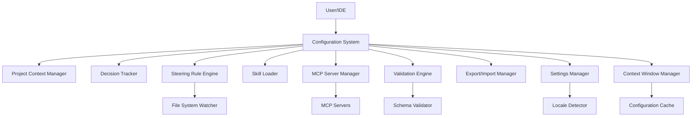
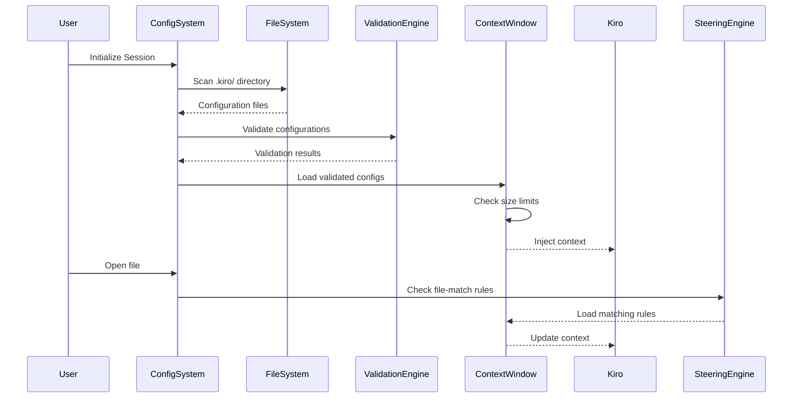
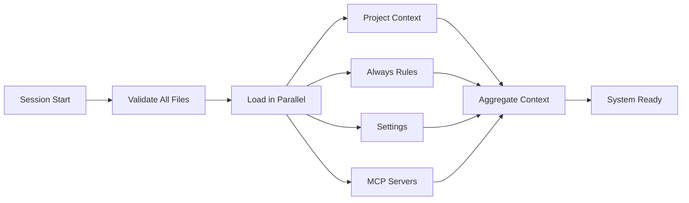

# Design Document: Kiro IDE Workspace Configuration System

## Overview

The Kiro IDE Workspace Configuration System is a comprehensive configuration management solution that enables developers to customize their workspace environment, extend Kiro's capabilities through external tools, maintain project documentation, track architectural decisions, and enforce coding standards through conditional rules.

### System Goals

1. **Extensibility**: Enable integration with external tools via MCP (Model Context Protocol) servers
2. **Context Optimization**: Efficiently manage context window usage through lazy loading and size limits
3. **Developer Productivity**: Automate repetitive tasks through custom skills and reduce interruptions with auto-approval
4. **Knowledge Preservation**: Capture project context and architectural decisions for long-term maintainability
5. **Standards Enforcement**: Apply coding standards conditionally based on file types or project context
6. **Multi-Language Support**: Provide localized templates and documentation for Turkish and English developers

### Key Design Principles

- **Modularity**: Components operate independently with clear interfaces
- **Performance-First**: Lazy loading, caching, and size limits prevent context window exhaustion
- **Graceful Degradation**: System continues operating even when individual configurations fail
- **Convention over Configuration**: Sensible defaults with opt-in customization
- **Security**: Validation of all external inputs and controlled tool execution


## Architecture

### High-Level Architecture



### Data Flow Diagram




### Component Responsibilities

| Component | Responsibility |
|-----------|----------------|
| Configuration System | Central orchestrator for all configuration loading, initialization, and lifecycle management |
| Project Context Manager | Manages project-context.md creation, loading, and truncation |
| Decision Tracker | Creates and manages ADR records in decisions.md |
| Steering Rule Engine | Loads and activates steering rules based on inclusion type (always/file-match/manual) |
| Skill Loader | Discovers, validates, and executes custom skills with parameter substitution |
| MCP Server Manager | Manages MCP server connections, reconnection logic, and tool execution |
| Validation Engine | Validates JSON, YAML, and markdown configurations against schemas |
| Export/Import Manager | Handles workspace configuration export to ZIP and import with validation |
| Settings Manager | Loads and hot-reloads .kiro/settings.json with locale detection |
| Context Window Manager | Tracks total context size and enforces 100KB limit with warnings |


## Components and Interfaces

### Configuration System (Core Module)

**Purpose**: Central orchestrator for workspace configuration lifecycle management.

**Key Interfaces**:

```typescript
interface IConfigurationSystem {
  // Lifecycle management
  initialize(workspaceRoot: string): Promise<InitializationResult>;
  reload(): Promise<void>;
  shutdown(): Promise<void>;

  // Component access
  getProjectContext(): IProjectContextManager;
  getDecisionTracker(): IDecisionTracker;
  getSteeringEngine(): ISteeringRuleEngine;
  getSkillLoader(): ISkillLoader;
  getMCPManager(): IMCPServerManager;
  getSettings(): ISettingsManager;

  // Status queries
  getLoadedConfigurationSummary(): ConfigurationSummary;
  getValidationErrors(): ValidationError[];
}

interface InitializationResult {
  success: boolean;
  loadedFiles: string[];
  errors: ValidationError[];
  warnings: string[];
  contextSize: number;
}
```


**Implementation Details**:

- Initialization sequence:
  1. Create `.kiro/` directory structure if missing
  2. Validate all configuration files
  3. Load configurations in priority order (project-context → always-rules → settings)
  4. Initialize MCP server connections
  5. Register file system watchers
  6. Report initialization summary

- Error handling: Continue initialization even if individual components fail, collect all errors for reporting
- Performance: Parallel loading of independent configuration files
- Thread safety: All public methods are thread-safe using internal locking


### Project Context Manager

**Purpose**: Manages project documentation that provides Kiro with architectural understanding.

**Key Interfaces**:

```typescript
interface IProjectContextManager {
  // Document management
  createProjectContext(overwrite?: boolean): Promise<void>;
  loadProjectContext(): Promise<string | null>;
  updateProjectContext(content: string): Promise<void>;

  // Status queries
  exists(): boolean;
  getSize(): number;
  wasLoadedSuccessfully(): boolean;
}

interface ProjectContextContent {
  overview: string;
  architecture: string;
  keyComponents: string;
  technicalDecisions: string;
  developmentGuidelines: string;
}
```

**Implementation Details**:

- File location: `{workspaceRoot}/.kiro/project-context.md`
- Size limit: 50KB with automatic truncation and warning
- Structure: Level 2 markdown headers (##) for each section
- Loading: Synchronous at session start, preserves all markdown formatting
- Truncation strategy: Cut at nearest paragraph boundary before 50KB limit


### Decision Tracker (ADR)

**Purpose**: Captures and maintains Architecture Decision Records with full lifecycle management.

**Key Interfaces**:

```typescript
interface IDecisionTracker {
  // Decision management
  createDecision(decision: DecisionInput): Promise<number>;
  updateDecisionStatus(id: number, status: DecisionStatus): Promise<void>;
  supersede(oldId: number, newId: number): Promise<void>;

  // Queries
  getDecision(id: number): Promise<Decision | null>;
  getAllDecisions(): Promise<Decision[]>;
  getDecisionsByStatus(status: DecisionStatus): Promise<Decision[]>;

  // Loading
  load(): Promise<string | null>;
  shouldLazyLoad(): boolean;
}

interface DecisionInput {
  context: string;  // Required, non-empty
  decision: string; // Required, non-empty
  consequences: string; // Required, non-empty
  alternatives?: string;
  status: DecisionStatus;
}

enum DecisionStatus {
  Proposed = 'Proposed',
  Accepted = 'Accepted',
  Deprecated = 'Deprecated',
  Superseded = 'Superseded'
}
```


**Implementation Details**:

- File location: `{workspaceRoot}/.kiro/decisions.md`
- ID generation: Sequential numeric starting from 1
- Date format: ISO 8601 (YYYY-MM-DD) for English, DD.MM.YYYY for Turkish
- Lazy loading: Not loaded at session start, loaded on-demand when "decision" keyword detected in user query
- Supersession logic:
  1. Add "Supersedes: [old_id]" to new decision
  2. Update old decision status to "Superseded"
  3. Add "Superseded by: [new_id]" to old decision
- Validation: Reject decisions with invalid status or missing required fields


### Steering Rule Engine

**Purpose**: Loads and activates steering rules based on inclusion type and file patterns.

**Key Interfaces**:

```typescript
interface ISteeringRuleEngine {
  // Rule discovery
  scanSteeringDirectory(): Promise<SteeringRule[]>;

  // Rule activation
  getAlwaysIncludedRules(): SteeringRule[];
  getFileMatchRules(filePath: string): SteeringRule[];
  activateManualRule(ruleName: string): Promise<void>;
  deactivateManualRule(ruleName: string): Promise<void>;

  // Status queries
  getActiveRules(): SteeringRule[];
  getTotalRulesSize(): number;
}

interface SteeringRule {
  name: string;
  description: string;
  inclusion: 'always' | 'file-match' | 'manual';
  filePattern?: string[];  // Required for file-match
  content: string;
  filePath: string;
  size: number;
}

interface SteeringRuleFrontmatter {
  name: string;           // Max 100 chars
  description: string;    // Max 500 chars
  inclusion: 'always' | 'file-match' | 'manual';
  filePattern?: string;   // Comma-separated, max 50 patterns
}
```


**Implementation Details**:

- Directory: `.kiro/steering/` with `.md` extension
- Scan timing: At session start within 10 seconds
- Always-included rules:
  - Load immediately at session start within 5 seconds
  - Persist in context for entire session
  - Maximum 50 files, 100KB per file, 2MB total
  - Load alphabetically until size limit reached
- File-match rules:
  - Activated when file opened/edited (within 2 seconds check, 3 seconds load)
  - Support glob patterns: `*`, `**`, `?`, `[]`, `{}`
  - Multiple patterns per rule (comma-separated, max 50)
  - Multiple rules can match same file (load all alphabetically)
- Manual rules:
  - Not loaded at session start
  - Activated/deactivated on command (within 3 seconds / 2 seconds)
  - Persist until deactivated or session ends
- Frontmatter parsing: YAML between `---` delimiters at file start
- Invalid files: Skip and log error, continue processing remaining files
- File system watcher: Monitor for changes during session (no auto-reload for always-included)


### Skill Loader and Executor

**Purpose**: Discovers, validates, and executes custom agent skills for repetitive tasks.

**Key Interfaces**:

```typescript
interface ISkillLoader {
  // Skill discovery
  loadSkills(): Promise<Skill[]>;
  reloadSkills(): Promise<void>;

  // Skill execution
  matchSkills(userInput: string): Skill[];
  executeSkill(skillName: string, parameters: Record<string, string>): Promise<string>;

  // Validation
  validateSkill(skill: Skill): ValidationResult;
}

interface Skill {
  name: string;              // Max 100 chars
  description: string;       // Max 500 chars
  triggerPatterns: string[]; // Max 20 patterns
  promptTemplate: string;    // Max 10KB
  parameters: string[];      // Extracted from template
  filePath: string;
  size: number;
}

interface SkillFrontmatter {
  name: string;
  description: string;
  triggers: string;  // Comma-separated patterns
}
```


**Implementation Details**:

- Directory: `.kiro/skills/` with `.md` extension
- Limits: Max 100 skills, 1MB per file, max 50 parameters per skill
- Loading: At workspace initialization, validate all skills
- Trigger matching:
  - Case-insensitive substring matching
  - Show all matching skills alphabetically if multiple match
- Template system:
  - Parameter syntax: `{{parameter_name}}`
  - Extract parameters via regex: `/\{\{([a-zA-Z0-9_]+)\}\}/g`
  - Validate all parameters provided before execution
  - Halt execution with error if parameter missing
- Validation:
  - Check required frontmatter fields (name, description, triggers)
  - Validate markdown structure
  - Check size limits
  - Skip invalid skills and log errors
- File structure:
```markdown
---
name: My Skill
description: Does something useful
triggers: keyword1, keyword2, keyword3
---

# Skill Instructions

Use {{param1}} and {{param2}} to accomplish the task...
```


### MCP Server Connection Manager

**Purpose**: Manages lifecycle of MCP server connections following the Model Context Protocol specification.

**Key Interfaces**:

```typescript
interface IMCPServerManager {
  // Connection lifecycle
  connectServer(config: MCPServerConfig): Promise<void>;
  disconnectServer(serverName: string): Promise<void>;
  reconnectServer(serverName: string): Promise<void>;

  // Tool execution
  executeTool(serverName: string, toolName: string, args: any): Promise<any>;
  isToolAutoApproved(toolIdentifier: string): boolean;

  // Status queries
  getServerStatus(serverName: string): ServerStatus;
  getAllServers(): MCPServerConfig[];
  getConnectionLog(): ConnectionLogEntry[];
}

interface MCPServerConfig {
  name: string;
  command: string;           // Max 1000 chars
  arguments?: string[];      // Max 50 elements, 500 chars each
  env?: Record<string, string>; // Max 100 entries, 500 chars each
}

interface ServerStatus {
  name: string;
  state: 'connecting' | 'connected' | 'disconnected' | 'failed' | 'unavailable';
  lastConnectionAttempt: string; // ISO 8601
  reconnectAttempts: number;
}
```


**Implementation Details**:

- Configuration file: `.kiro/mcp/settings.json` (max 10MB, max 100 servers)
- Protocol: JSON-RPC 2.0 over stdio or HTTP with SSE (based on [MCP specification](https://modelcontextprotocol.io/specification/2025-03-26/index))
- Transport: Primarily stdio (launch as subprocess, communicate via stdin/stdout)
- Message format: UTF-8 encoded JSON-RPC, newline-delimited
- Connection process:
  1. Launch server process with configured command and arguments
  2. Set environment variables
  3. Establish stdio streams
  4. Send initialization handshake
  5. Log connection event with ISO 8601 timestamp
- Reconnection strategy:
  - Exponential backoff: 1s, 2s, 4s, 8s, 16s, 32s (max 5 attempts)
  - Mark as unavailable after exhaustion
  - Display notification to user
- Auto-approve list:
  - Load from configuration at startup
  - Support exact matching: `filesystem:read_file`
  - Support wildcard patterns: `filesystem:read_*` matches `filesystem:read_file` and `filesystem:read_directory`
  - Reload within 5 seconds of file modification
  - Empty list on invalid syntax
- Tool execution:
  - Check auto-approve list first
  - Prompt user if not auto-approved (60 second timeout → deny)
  - Log all execution attempts
- Error handling: Connection failures logged but don't block system initialization


### Validation Engine

**Purpose**: Validates all configuration files against schemas before loading.

**Key Interfaces**:

```typescript
interface IValidationEngine {
  // File validation
  validateJSON(filePath: string, schema?: object): ValidationResult;
  validateYAML(filePath: string, schema?: object): ValidationResult;
  validateMarkdownFrontmatter(filePath: string): ValidationResult;

  // Schema management
  registerSchema(schemaId: string, schema: object): void;
  getSchema(schemaId: string): object | null;
}

interface ValidationResult {
  valid: boolean;
  errors: ValidationError[];
  warnings: ValidationWarning[];
}

interface ValidationError {
  filePath: string;
  line?: number;
  column?: number;
  message: string;
  field?: string;
}

interface ValidationWarning {
  filePath: string;
  message: string;
}
```


**Implementation Details**:

- JSON validation:
  - Use JSON.parse() with try-catch
  - Report line/column from parser error
  - Optionally validate against JSON Schema draft-07
- YAML validation:
  - Parse frontmatter between `---` delimiters
  - Report syntax errors with position
  - Validate against predefined schemas for steering rules and skills
- Steering rule schema:
```json
{
  "type": "object",
  "required": ["name", "description", "inclusion"],
  "properties": {
    "name": {"type": "string", "maxLength": 100},
    "description": {"type": "string", "maxLength": 500},
    "inclusion": {"enum": ["always", "file-match", "manual"]},
    "filePattern": {"type": "string"}
  },
  "if": {"properties": {"inclusion": {"const": "file-match"}}},
  "then": {"required": ["filePattern"]}
}
```
- Skill schema:
```json
{
  "type": "object",
  "required": ["name", "description", "triggers"],
  "properties": {
    "name": {"type": "string", "maxLength": 100},
    "description": {"type": "string", "maxLength": 500},
    "triggers": {"type": "string"}
  }
}
```


- Settings schema:
```json
{
  "type": "object",
  "properties": {
    "language": {"enum": ["tr", "en"]},
    "autoSave": {"type": "boolean"},
    "diagnosticLevel": {"enum": ["error", "warning", "info"]},
    "suggestionFrequency": {"type": "integer", "minimum": 1, "maximum": 10}
  }
}
```
- Error reporting:
  - Include file path in all errors
  - Include line/column when available from parser
  - Describe expected vs actual for schema violations
  - Aggregate all errors per file before reporting
- Failure handling: Skip invalid file, log error, continue with remaining files


### Export/Import Manager

**Purpose**: Enables sharing workspace configurations across projects and teams.

**Key Interfaces**:

```typescript
interface IExportImportManager {
  // Export
  exportConfiguration(outputPath: string): Promise<ExportResult>;

  // Import
  importConfiguration(zipPath: string, options?: ImportOptions): Promise<ImportResult>;
  validateBundle(zipPath: string): Promise<ValidationResult>;
}

interface ExportResult {
  success: boolean;
  zipPath: string;
  includedFiles: string[];
  excludedFiles: string[];
  size: number;
  duration: number; // milliseconds
}

interface ImportResult {
  success: boolean;
  importedFiles: string[];
  skippedFiles: string[];
  errors: ValidationError[];
}

interface ImportOptions {
  overwriteExisting?: boolean; // Default: false
  dryRun?: boolean;            // Default: false
}
```


**Implementation Details**:

- Export process:
  1. Scan `.kiro/steering/`, `.kiro/skills/`, `.kiro/mcp/`
  2. Include `project-context.md` and `decisions.md` if present
  3. Filter sensitive data:
     - Skip files containing: `password`, `token`, `key`, `secret`, `credential`, `certificate` (case-insensitive)
     - Skip absolute paths: `/path/to/file` or `C:\path\to\file`
  4. Create manifest.json with version, timestamp (ISO 8601), file list
  5. Create ZIP archive with all files
  6. Enforce 30 second timeout or 10MB size limit
- Manifest format:
```json
{
  "version": "1.0.0",
  "exportedAt": "2026-06-05T14:30:00Z",
  "files": [
    ".kiro/steering/rule1.md",
    ".kiro/skills/skill1.md",
    ".kiro/mcp/settings.json",
    ".kiro/project-context.md"
  ]
}
```
- Import process:
  1. Validate ZIP format
  2. Extract and validate manifest.json
  3. Validate each file against schemas (per Requirement 11)
  4. Check for existing files
  5. Copy only new files (default) or overwrite if option set
  6. Report summary with counts
- Error handling:
  - Export failure: Display error, provide partial file path if timeout
  - Import failure: Display validation error, don't modify workspace
  - Continue with remaining files on individual file errors


### Settings Manager

**Purpose**: Manages Kiro-specific settings with hot-reload and locale detection.

**Key Interfaces**:

```typescript
interface ISettingsManager {
  // Settings access
  getSettings(): Settings;
  getSetting<K extends keyof Settings>(key: K): Settings[K];
  updateSetting<K extends keyof Settings>(key: K, value: Settings[K]): Promise<void>;

  // Lifecycle
  load(): Promise<void>;
  reload(): Promise<void>;

  // Language
  getLanguage(): 'tr' | 'en';
  detectSystemLocale(): string;
}

interface Settings {
  language?: 'tr' | 'en';
  autoSave: boolean;
  diagnosticLevel: 'error' | 'warning' | 'info';
  suggestionFrequency: number; // 1-10
}

const DEFAULT_SETTINGS: Settings = {
  autoSave: true,
  diagnosticLevel: 'warning',
  suggestionFrequency: 5
};
```


**Implementation Details**:

- File location: `.kiro/settings.json`
- Hot-reload:
  - Watch file for changes using file system watcher
  - Detect changes within 2 seconds
  - Reload and validate without workspace restart
  - Notify components of setting changes
- Language detection:
  1. Check `language` field in settings.json
  2. If absent, detect system locale (e.g., `en-US`, `tr-TR`)
  3. Extract first 2 characters (`en`, `tr`)
  4. If locale is `tr`, use Turkish; otherwise use English
- Validation:
  - Validate against JSON schema on load
  - Log errors for invalid values with expected values
  - Use defaults for missing fields
  - Ignore unknown keys with warning log
- Template selection:
  - Load templates from `.kiro/templates/tr/` or `.kiro/templates/en/`
  - Fallback to English if Turkish template missing
- Date formatting:
  - Turkish: DD.MM.YYYY (e.g., "05.06.2026")
  - English: YYYY-MM-DD (e.g., "2026-06-05")


### Context Window Manager

**Purpose**: Optimizes context window usage and enforces size limits.

**Key Interfaces**:

```typescript
interface IContextWindowManager {
  // Size tracking
  trackConfigLoad(filePath: string, size: number): void;
  getTotalSize(): number;
  getConfigSizes(): Map<string, number>;

  // Optimization
  compressWhitespace(content: string, preserveCodeBlocks: boolean): string;
  shouldTruncate(filePath: string, size: number, limit: number): boolean;

  // Warnings
  checkSizeLimit(): void;
  getWarnings(): string[];
}
```

**Implementation Details**:

- Size tracking:
  - Track byte size of each loaded configuration file
  - Aggregate total across all configurations
  - Warn when total exceeds 100KB threshold
- Loading priority order:
  1. project-context.md
  2. Always-included steering rules (alphabetically)
  3. Active file-match steering rules (alphabetically)
  4. decisions.md (lazy loaded)
- Whitespace compression:
  - Replace multiple consecutive spaces/tabs with single space
  - Replace multiple newlines with single newline
  - Preserve whitespace inside fenced code blocks (triple backticks)
  - Implementation: Use regex with code block detection
- Lazy loading strategy:
  - decisions.md not loaded at session start
  - Load when "decision" keyword detected in query
  - Load within 3 seconds of request


## Data Models

### Configuration File Schemas

#### MCP Server Configuration (`.kiro/mcp/settings.json`)

```json
{
  "$schema": "http://json-schema.org/draft-07/schema#",
  "type": "object",
  "properties": {
    "mcpServers": {
      "type": "array",
      "maxItems": 100,
      "items": {
        "type": "object",
        "required": ["name", "command"],
        "properties": {
          "name": {"type": "string", "minLength": 1},
          "command": {"type": "string", "maxLength": 1000},
          "arguments": {
            "type": "array",
            "maxItems": 50,
            "items": {"type": "string", "maxLength": 500}
          },
          "env": {
            "type": "object",
            "maxProperties": 100,
            "patternProperties": {
              ".*": {"type": "string", "maxLength": 500}
            }
          }
        }
      }
    },
    "autoApprove": {
      "type": "array",
      "items": {"type": "string"}
    }
  }
}
```


#### Steering Rule Frontmatter

```yaml
---
name: Code Review Standards
description: Enforce code review checklist for all PRs
inclusion: always
---
# [Rule content in markdown]
```

For file-match rules:
```yaml
---
name: TypeScript Conventions
description: TypeScript-specific coding standards
inclusion: file-match
filePattern: "**/*.ts, **/*.tsx"
---
# [Rule content in markdown]
```

#### Skill Definition Format

```yaml
---
name: API Endpoint Generator
description: Generate REST API endpoint with tests and documentation
triggers: create api, generate endpoint, new rest api
---

# Generate REST API Endpoint

Create a new REST API endpoint with the following specifications:

- Method: {{method}}
- Path: {{path}}
- Description: {{description}}

Include:
1. Route handler implementation
2. Input validation
3. Unit tests
4. API documentation
```


#### ADR Record Format (English)

```markdown
## Decision 1

**Date:** 2026-06-05
**Status:** Accepted

### Context

[Describe the context and problem statement]

### Decision

[Describe the decision that was made]

### Consequences

[Describe the consequences of this decision]

### Alternatives

[Optional: Describe alternatives that were considered]
```

#### ADR Record Format (Turkish)

```markdown
## Karar 1

**Tarih:** 05.06.2026
**Durum:** Kabul Edildi

### Bağlam

[Bağlamı ve problem ifadesini açıklayın]

### Karar

[Alınan kararı açıklayın]

### Sonuçlar

[Bu kararın sonuçlarını açıklayın]

### Alternatifler

[İsteğe bağlı: Değerlendirilen alternatifleri açıklayın]
```


#### Settings Schema (`.kiro/settings.json`)

```json
{
  "$schema": "http://json-schema.org/draft-07/schema#",
  "type": "object",
  "properties": {
    "language": {
      "type": "string",
      "enum": ["tr", "en"],
      "description": "UI and template language"
    },
    "autoSave": {
      "type": "boolean",
      "description": "Enable automatic file saving",
      "default": true
    },
    "diagnosticLevel": {
      "type": "string",
      "enum": ["error", "warning", "info"],
      "description": "Minimum diagnostic level to display",
      "default": "warning"
    },
    "suggestionFrequency": {
      "type": "integer",
      "minimum": 1,
      "maximum": 10,
      "description": "Suggestions per minute",
      "default": 5
    }
  }
}
```


## API Interfaces

### Public APIs for Workspace Initialization

```typescript
// Main entry point for workspace configuration
class WorkspaceConfiguration {
  // Initialize workspace configuration system
  static async initialize(
    workspaceRoot: string,
    options?: InitOptions
  ): Promise<IConfigurationSystem>;

  // Prompt user for workspace initialization
  static async promptInitialization(
    workspaceRoot: string
  ): Promise<boolean>;

  // Create directory structure
  static async createStructure(
    workspaceRoot: string,
    projectType?: ProjectType
  ): Promise<void>;
}

interface InitOptions {
  skipPrompt?: boolean;
  createStructure?: boolean;
  loadConfigurations?: boolean;
}

enum ProjectType {
  NodeJS = 'nodejs',
  Python = 'python',
  Go = 'go',
  Rust = 'rust',
  Generic = 'generic'
}
```


### Configuration Loading/Reloading APIs

```typescript
// Configuration reload
interface IConfigurationSystem {
  // Reload all configurations
  reload(): Promise<ReloadResult>;

  // Reload specific component
  reloadComponent(component: ConfigComponent): Promise<void>;

  // Subscribe to reload events
  onReload(callback: (result: ReloadResult) => void): Disposable;
}

enum ConfigComponent {
  ProjectContext = 'project-context',
  Decisions = 'decisions',
  SteeringRules = 'steering-rules',
  Skills = 'skills',
  MCPServers = 'mcp-servers',
  Settings = 'settings'
}

interface ReloadResult {
  success: boolean;
  reloadedComponents: ConfigComponent[];
  errors: ValidationError[];
  duration: number;
}
```


### Steering Rule Activation/Deactivation

```typescript
interface ISteeringRuleEngine {
  // Manual rule activation
  activateRule(ruleName: string): Promise<ActivationResult>;
  deactivateRule(ruleName: string): Promise<DeactivationResult>;

  // Batch operations
  activateRules(ruleNames: string[]): Promise<BatchResult>;
  deactivateRules(ruleNames: string[]): Promise<BatchResult>;

  // Query active rules
  getActiveRules(): SteeringRule[];
  getAvailableManualRules(): SteeringRule[];

  // Events
  onRuleActivated(callback: (rule: SteeringRule) => void): Disposable;
  onRuleDeactivated(callback: (ruleName: string) => void): Disposable;
}

interface ActivationResult {
  success: boolean;
  ruleName: string;
  loadTime: number;
  error?: string;
}

interface BatchResult {
  succeeded: string[];
  failed: Array<{ruleName: string; error: string}>;
}
```


### Skill Execution Interface

```typescript
interface ISkillLoader {
  // Execute skill with parameters
  executeSkill(
    skillName: string,
    parameters: SkillParameters
  ): Promise<SkillExecutionResult>;

  // Interactive execution with parameter prompts
  executeSkillInteractive(skillName: string): Promise<SkillExecutionResult>;

  // Get skill information
  getSkill(skillName: string): Skill | null;
  getAllSkills(): Skill[];
  searchSkills(query: string): Skill[];
}

type SkillParameters = Record<string, string>;

interface SkillExecutionResult {
  success: boolean;
  output: string;
  executionTime: number;
  error?: string;
}
```

### Export/Import Operations

```typescript
interface IExportImportManager {
  // Export workspace configuration
  exportConfiguration(
    outputPath?: string,
    options?: ExportOptions
  ): Promise<ExportResult>;

  // Import configuration bundle
  importConfiguration(
    zipPath: string,
    options?: ImportOptions
  ): Promise<ImportResult>;

  // Validate bundle before import
  validateBundle(zipPath: string): Promise<BundleValidation>;
}

interface ExportOptions {
  includeSensitive?: boolean;  // Default: false
  compress?: boolean;          // Default: true
}

interface BundleValidation {
  valid: boolean;
  manifestValid: boolean;
  filesValid: boolean;
  errors: ValidationError[];
  warnings: ValidationWarning[];
}
```


## File System Layout

### .kiro/ Directory Structure

```
.kiro/
├── README.md                      # Documentation about folder structure
├── project-context.md             # Project architecture and context (max 50KB)
├── decisions.md                   # Architecture Decision Records (lazy loaded)
├── settings.json                  # Kiro-specific settings
│
├── steering/                      # Steering rules directory
│   ├── always-coding-standards.md # Always included
│   ├── always-security-checklist.md
│   ├── filematch-typescript.md    # File-match rules
│   ├── filematch-react.md
│   ├── manual-performance.md      # Manual activation
│   └── manual-accessibility.md
│
├── skills/                        # Custom agent skills
│   ├── api-generator.md
│   ├── test-creator.md
│   └── documentation-writer.md
│
├── mcp/                          # MCP server configuration
│   ├── settings.json             # Server definitions and auto-approve
│   └── settings.json.example     # Example configuration
│
├── specs/                        # Specification documents
│   └── [feature-name]/
│       ├── .config.kiro
│       ├── requirements.md
│       ├── design.md
│       └── tasks.md
│
└── templates/                    # Language-specific templates
    ├── en/                       # English templates
    │   ├── project-context.md
    │   ├── decision-template.md
    │   ├── steering-rule.md
    │   └── skill.md
    └── tr/                       # Turkish templates
        ├── project-context.md
        ├── decision-template.md
        ├── steering-rule.md
        └── skill.md
```


### File Organization Patterns

**Naming Conventions**:
- Steering rules: `[inclusion-type]-[descriptive-name].md`
  - Examples: `always-coding-standards.md`, `filematch-typescript.md`, `manual-performance.md`
- Skills: `[descriptive-name].md`
  - Examples: `api-generator.md`, `test-creator.md`
- All lowercase with hyphens for spaces

**Size Limits Summary**:
| File/Directory | Individual Limit | Total Limit | Count Limit |
|----------------|------------------|-------------|-------------|
| project-context.md | 50KB | - | 1 file |
| decisions.md | - | - | 1 file |
| Always-included rules | 100KB | 2MB | 50 files |
| File-match rules | 100KB | - | No limit |
| Manual rules | 100KB | - | No limit |
| Skills | 1MB | - | 100 files |
| MCP configuration | 10MB | - | 100 servers |

**File Watching**:
- `.kiro/settings.json`: Hot-reload within 2 seconds
- `.kiro/mcp/settings.json`: Hot-reload auto-approve list within 5 seconds
- Steering rules: No hot-reload (load at next session)
- Skills: No hot-reload (load at next session)


## Performance Considerations

### Context Window Optimization Strategies

**1. Size Tracking and Limits**
- Track byte size of all loaded configurations
- Warn at 100KB threshold (not a hard limit)
- Hard limits on individual files prevent runaway sizes
- Loading order optimizes for most frequently used content first

**2. Lazy Loading Mechanisms**

| Component | Load Timing | Trigger |
|-----------|-------------|---------|
| project-context.md | Session start | Automatic |
| Always-included rules | Session start | Automatic |
| File-match rules | File open/edit | File path match |
| Manual rules | User command | Explicit activation |
| decisions.md | On demand | "decision" keyword in query |
| Skills | Session start (metadata only) | Full load on execution |

**3. Whitespace Compression**
- Compress multiple spaces/tabs to single space
- Compress multiple newlines to single newline
- Preserve whitespace in code blocks (triple backticks)
- Apply to all markdown content before loading into context
- Estimated reduction: 10-20% for typical markdown


**4. Caching Strategies**

```typescript
interface ConfigurationCache {
  // Parsed configuration cache
  parsedConfigs: Map<string, ParsedConfig>;

  // Validation results cache
  validationResults: Map<string, ValidationResult>;

  // Compiled glob patterns
  compiledPatterns: Map<string, RegExp>;

  // File modification times
  fileMTimes: Map<string, number>;
}
```

Cache invalidation:
- Clear cache entry when file modified (detected via mtime)
- Clear all caches on explicit reload
- Keep validation results until file changes
- Compiled glob patterns cached for session lifetime

**5. File Watching and Hot Reload**

Debouncing strategy:
- Buffer file change events for 500ms
- Process accumulated changes in single batch
- Prevents reload thrashing during rapid file edits

File system watcher setup:
```typescript
// Watch .kiro/settings.json with 2 second detection
watcher.watch('.kiro/settings.json', {
  persistent: true,
  ignoreInitial: true,
  awaitWriteFinish: {
    stabilityThreshold: 500,
    pollInterval: 100
  }
});

// Watch .kiro/mcp/settings.json for auto-approve list
watcher.watch('.kiro/mcp/settings.json', {
  persistent: true,
  ignoreInitial: true,
  awaitWriteFinish: {
    stabilityThreshold: 1000,
    pollInterval: 200
  }
});
```


**6. Parallel Loading**



Independent components load in parallel:
- project-context.md
- Always-included steering rules
- Settings
- MCP server connections

Sequential only when dependencies exist:
- Settings must load before template selection
- Validation must complete before loading

**7. Memory Optimization**

- Stream large files rather than loading entirely into memory
- Truncate project-context.md at 50KB during read
- Release parsed AST after extracting necessary data
- Use WeakMaps for temporary data that can be garbage collected


## Error Handling Strategy

### Validation Error Reporting

**Error Levels**:
1. **Critical**: System cannot initialize (e.g., workspace root invalid)
2. **High**: Component cannot load (e.g., malformed JSON)
3. **Medium**: Individual file invalid (e.g., missing frontmatter field)
4. **Low**: Non-essential feature unavailable (e.g., template file missing, fallback used)

**Error Structure**:
```typescript
interface ValidationError {
  level: 'critical' | 'high' | 'medium' | 'low';
  component: ConfigComponent;
  filePath?: string;
  line?: number;
  column?: number;
  field?: string;
  message: string;
  suggestion?: string;
}
```

**Error Reporting Format**:
```
Configuration Validation Summary:
  ✓ 12 files loaded successfully
  ✗ 2 files failed validation

Errors:
  [HIGH] .kiro/mcp/settings.json:5:12
    Invalid JSON syntax: Unexpected token }
    Suggestion: Check for missing comma on line 4

  [MEDIUM] .kiro/steering/custom-rule.md
    Missing required frontmatter field: inclusion
    Suggestion: Add 'inclusion: always|file-match|manual' to frontmatter
```


### Graceful Degradation

**Component Failure Handling**:

| Component Failure | System Behavior | User Impact |
|-------------------|-----------------|-------------|
| project-context.md missing | Continue without project context | No architecture hints |
| project-context.md > 50KB | Truncate and warn | Partial context available |
| Steering rule invalid | Skip rule, continue with others | Specific rule unavailable |
| All steering rules invalid | Continue without rules | No custom guidelines |
| Skill invalid | Skip skill, continue with others | Specific skill unavailable |
| MCP server connection failed | Mark unavailable, retry with backoff | External tools unavailable |
| settings.json invalid | Use defaults | Default behavior applied |
| decisions.md missing | Lazy load returns null | ADR features disabled |

**Fallback Mechanisms**:
1. **Configuration**: Use defaults when files missing or invalid
2. **Templates**: Fall back to English when Turkish missing
3. **MCP Servers**: Continue without failed servers
4. **Steering Rules**: Load valid rules, skip invalid
5. **Skills**: Load valid skills, skip invalid


### Logging and Diagnostics

**Log Levels**:
```typescript
enum LogLevel {
  ERROR = 'error',   // System failures, invalid state
  WARN = 'warn',     // Non-critical issues, using fallbacks
  INFO = 'info',     // Normal operations, status updates
  DEBUG = 'debug'    // Detailed diagnostic information
}
```

**Log Output**:
```typescript
interface LogEntry {
  timestamp: string;      // ISO 8601
  level: LogLevel;
  component: string;
  message: string;
  metadata?: any;
  stackTrace?: string;
}
```

**Diagnostic Collection**:
- Log all configuration loading events
- Track timing for performance analysis
- Record validation errors with full context
- Capture MCP server connection attempts and failures
- Store last 1000 log entries in memory
- Write persistent log file in `.kiro/logs/` (daily rotation)

**Example Log Output**:
```
[2026-06-05T14:30:00Z] INFO  ConfigSystem: Initializing workspace configuration
[2026-06-05T14:30:00Z] INFO  ConfigSystem: Loading project-context.md (45.2 KB)
[2026-06-05T14:30:01Z] INFO  SteeringEngine: Loading 3 always-included rules
[2026-06-05T14:30:01Z] WARN  SteeringEngine: Rule file too large: custom-rule.md (150 KB > 100 KB limit)
[2026-06-05T14:30:02Z] ERROR MCPManager: Connection failed: filesystem-server (ENOENT: command not found)
[2026-06-05T14:30:02Z] INFO  ConfigSystem: Initialization complete (2.1s, 12 files loaded, 1 error, 1 warning)
```


## Multi-Language Support

### Template System Design

**Template Directory Structure**:
```
.kiro/templates/
├── en/
│   ├── project-context.md
│   ├── decision-template.md
│   ├── steering-rule.md
│   ├── skill.md
│   └── README.md
└── tr/
    ├── project-context.md
    ├── decision-template.md
    ├── steering-rule.md
    ├── skill.md
    └── README.md
```

**Template Loading Logic**:
```typescript
class TemplateManager {
  async loadTemplate(templateName: string, language: string): Promise<string> {
    const primaryPath = `.kiro/templates/${language}/${templateName}`;
    const fallbackPath = `.kiro/templates/en/${templateName}`;

    // Try language-specific template first
    if (await fileExists(primaryPath)) {
      return await readFile(primaryPath);
    }

    // Fall back to English
    if (language !== 'en' && await fileExists(fallbackPath)) {
      logger.warn(`Template not found for language ${language}, using English fallback`);
      return await readFile(fallbackPath);
    }

    throw new Error(`Template not found: ${templateName}`);
  }
}
```


### Locale Detection Logic

```typescript
class LocaleDetector {
  detectLanguage(settings: Settings): 'tr' | 'en' {
    // 1. Check explicit setting
    if (settings.language) {
      return settings.language;
    }

    // 2. Detect system locale
    const systemLocale = this.getSystemLocale();
    const languageCode = systemLocale.substring(0, 2).toLowerCase();

    // 3. Return Turkish if detected, otherwise English
    return languageCode === 'tr' ? 'tr' : 'en';
  }

  private getSystemLocale(): string {
    // Node.js
    if (typeof process !== 'undefined' && process.env.LANG) {
      return process.env.LANG;
    }

    // Browser
    if (typeof navigator !== 'undefined') {
      return navigator.language || navigator.languages?.[0] || 'en-US';
    }

    // Default
    return 'en-US';
  }
}
```

**Locale Examples**:
- `tr-TR` → `tr` → Turkish
- `en-US` → `en` → English
- `en-GB` → `en` → English
- `fr-FR` → `fr` → English (fallback)


### Fallback Mechanisms

**Fallback Chain**:
1. Requested language template (e.g., `tr/project-context.md`)
2. English template (e.g., `en/project-context.md`)
3. Hardcoded default template in code
4. Error if none available

**Language-Specific Formatting**:

```typescript
class DateFormatter {
  format(date: Date, language: 'tr' | 'en'): string {
    if (language === 'tr') {
      // Turkish: DD.MM.YYYY
      const day = date.getDate().toString().padStart(2, '0');
      const month = (date.getMonth() + 1).toString().padStart(2, '0');
      const year = date.getFullYear();
      return `${day}.${month}.${year}`;
    } else {
      // English: YYYY-MM-DD (ISO 8601)
      return date.toISOString().split('T')[0];
    }
  }
}
```

**Localized Strings**:

```typescript
const LOCALIZED_STRINGS = {
  en: {
    decision: 'Decision',
    date: 'Date',
    status: 'Status',
    context: 'Context',
    consequences: 'Consequences',
    alternatives: 'Alternatives',
    proposed: 'Proposed',
    accepted: 'Accepted',
    deprecated: 'Deprecated',
    superseded: 'Superseded'
  },
  tr: {
    decision: 'Karar',
    date: 'Tarih',
    status: 'Durum',
    context: 'Bağlam',
    consequences: 'Sonuçlar',
    alternatives: 'Alternatifler',
    proposed: 'Önerildi',
    accepted: 'Kabul Edildi',
    deprecated: 'Kullanımdan Kaldırıldı',
    superseded: 'Değiştirildi'
  }
};
```


## Correctness Properties

*A property is a characteristic or behavior that should hold true across all valid executions of a system—essentially, a formal statement about what the system should do. Properties serve as the bridge between human-readable specifications and machine-verifiable correctness guarantees.*

### Applicability Assessment

This system is suitable for property-based testing because it involves:
- Configuration parsing and validation (pure functions with clear input/output)
- Pattern matching algorithms (glob patterns, wildcards)
- Data transformation (markdown parsing, template substitution)
- Business logic (approval workflows, decision tracking)

However, some aspects are NOT suitable for PBT:
- File system operations and timing constraints → Integration tests
- UI prompts and user interactions → Mock-based tests
- MCP server network communication → Integration tests with mocks

The following properties focus on testable logic that benefits from randomized testing across many inputs.


### Property 1: Configuration Schema Validation

*For any* MCP server configuration object, validation SHALL correctly accept configurations with all required fields (name, command) and valid optional fields, and SHALL reject configurations missing required fields or containing invalid field types.

**Validates: Requirements 1.2, 1.3**

### Property 2: Connection Parameter Boundary Validation

*For any* MCP server configuration, the validation system SHALL reject configurations where:
- Command string exceeds 1000 characters
- Arguments array exceeds 50 elements
- Any argument string exceeds 500 characters
- Environment variables exceed 100 entries
- Any environment variable key or value exceeds 500 characters

**Validates: Requirements 1.4, 1.5**

### Property 3: Auto-Approve Wildcard Pattern Matching

*For any* tool identifier and auto-approve list containing wildcard patterns (with trailing asterisk syntax), the matching algorithm SHALL return true if the tool identifier matches any exact string OR matches any wildcard pattern prefix, and SHALL return false otherwise.

**Validates: Requirements 2.2, 2.3, 2.4**


### Property 4: Markdown Formatting Preservation (Round-Trip)

*For any* project-context.md file containing valid markdown elements (headers, lists, code blocks, hyperlinks), writing the content and then reading it back SHALL preserve all formatting elements without modification.

**Validates: Requirements 3.8**

### Property 5: Decision Append Behavior

*For any* existing decisions.md file with existing content, appending a new decision SHALL preserve all original content and add the new decision after it, maintaining file integrity.

**Validates: Requirements 4.1**

### Property 6: Decision Structure Completeness

*For any* valid decision record, the generated markdown SHALL include all required section labels: "Decision ID", "Date", "Status", "Context", "Decision", "Consequences", and "Alternatives".

**Validates: Requirements 4.2**

### Property 7: Decision Required Field Validation

*For any* decision input, the validation system SHALL reject decisions where "Context", "Decision", or "Consequences" fields are empty or whitespace-only.

**Validates: Requirements 4.3**


### Property 8: Sequential Decision ID Generation

*For any* sequence of decision creation operations, the generated IDs SHALL form a continuous sequence starting at 1 and incrementing by 1 for each new decision (1, 2, 3, ..., N).

**Validates: Requirements 4.4**

### Property 9: Decision Status Enumeration Validation

*For any* decision status value, validation SHALL accept only the exact strings "Proposed", "Accepted", "Deprecated", or "Superseded", and SHALL reject all other values with a descriptive error message.

**Validates: Requirements 4.5, 4.6**

### Property 10: ISO 8601 Date Format Validation

*For any* decision record, the Date field SHALL match the ISO 8601 date format pattern (YYYY-MM-DD) when validated with regex `^\d{4}-\d{2}-\d{2}$`.

**Validates: Requirements 4.9**


### Property 11: Frontmatter Field Extraction

*For any* valid markdown file with YAML frontmatter delimited by `---` markers, the parser SHALL correctly extract all key-value pairs and make them accessible as structured data.

**Validates: Requirements 5.2, 5.10**

### Property 12: Frontmatter Schema Validation

*For any* steering rule frontmatter, validation SHALL enforce: name field is string ≤100 characters, description field is string ≤500 characters, and inclusion field is one of {always, file-match, manual}. For file-match rules, filePattern field must be present.

**Validates: Requirements 5.10, 11.3, 11.4**

### Property 13: Glob Pattern Matching

*For any* file path and glob pattern (supporting `*`, `**`, `?`, `[]`, `{}`), the pattern matching algorithm SHALL return true if the path matches the pattern according to standard glob semantics, and false otherwise.

**Validates: Requirements 6.3, 6.4, 6.7**


### Property 14: Multiple Glob Pattern Matching

*For any* file path and file-match rule with comma-separated glob patterns, the rule SHALL match the file if ANY of the individual patterns match the file path.

**Validates: Requirements 6.4**

### Property 15: Skill Parameter Extraction

*For any* skill template containing parameter placeholders in `{{parameter_name}}` syntax, the parser SHALL extract all unique parameter names from the template.

**Validates: Requirements 8.4**

### Property 16: Skill Parameter Substitution

*For any* skill template with parameter placeholders and a complete parameter mapping, substitution SHALL replace all `{{parameter_name}}` occurrences with their corresponding values, producing a template with no remaining placeholders.

**Validates: Requirements 8.5**


### Property 17: Skill Trigger Case-Insensitive Matching

*For any* user input string and skill trigger pattern, the matching algorithm SHALL perform case-insensitive substring matching, returning true if the lowercase user input contains the lowercase trigger pattern.

**Validates: Requirements 8.3**

### Property 18: Missing Parameter Detection

*For any* skill template and parameter mapping, if the template contains a parameter placeholder `{{param}}` that is not present in the mapping, the validation SHALL return an error indicating the missing parameter name.

**Validates: Requirements 8.8**

### Property 19: Whitespace Compression with Code Block Preservation

*For any* markdown content, whitespace compression SHALL replace multiple consecutive spaces/tabs with a single space and multiple newlines with a single newline, while preserving all whitespace within fenced code blocks (delimited by triple backticks).

**Validates: Requirements 9.6, 9.7**


### Property 20: JSON Validation Error Reporting

*For any* JSON file with syntax errors, the validation engine SHALL report an error containing the file path and, when available from the parser, the line and column numbers of the syntax error.

**Validates: Requirements 11.2**

### Property 21: YAML Validation Error Reporting

*For any* YAML file (or frontmatter) with syntax errors, the validation engine SHALL report an error containing the file path and, when available from the parser, the position of the syntax error.

**Validates: Requirements 11.2**

### Property 22: Configuration Loading Resilience

*For any* set of configuration files where some are valid and some are invalid, the loading process SHALL load all valid files successfully and continue operation, while collecting and reporting errors for all invalid files without halting.

**Validates: Requirements 11.5, 11.6**


### Property 23: Project Type Detection

*For any* workspace root directory, the project type detection algorithm SHALL return the correct project type by checking for presence of: package.json → NodeJS, requirements.txt or pyproject.toml → Python, go.mod → Go, Cargo.toml → Rust, or Generic if none found.

**Validates: Requirements 12.6**

### Property 24: Locale Language Code Extraction

*For any* locale string in format "XX-YY" or "XX", the language detection SHALL extract the first two characters as the language code, converting to lowercase.

**Validates: Requirements 13.4**

### Property 25: Template Fallback Chain

*For any* template request with language code, the template manager SHALL attempt to load from language-specific directory first, and if not found, SHALL fall back to English template directory.

**Validates: Requirements 13.7**


### Property 26: Date Formatting by Language

*For any* date value, the formatting function SHALL produce DD.MM.YYYY format when language is "tr" and SHALL produce YYYY-MM-DD format when language is "en".

**Validates: Requirements 13.8, 13.9**

### Property 27: Sensitive Data Filtering

*For any* file content during export, the filtering algorithm SHALL exclude the file if it contains case-insensitive matches for sensitive keywords ("password", "token", "key", "secret", "credential", "certificate") or absolute path patterns (starting with "/" or drive letters like "C:\").

**Validates: Requirements 14.2**

### Property 28: Export Manifest Completeness

*For any* successful export operation, the generated manifest.json SHALL contain a valid semantic version, an ISO 8601 timestamp, and a list of relative paths for all included files.

**Validates: Requirements 14.3**


### Property 29: Import File Preservation

*For any* import operation with default options, files that already exist in the target workspace SHALL NOT be overwritten, and only new files (not present in workspace) SHALL be copied from the bundle.

**Validates: Requirements 14.6, 14.7**

### Property 30: Settings Schema Validation

*For any* settings.json content, validation SHALL enforce: language ∈ {tr, en}, autoSave is boolean, diagnosticLevel ∈ {error, warning, info}, suggestionFrequency is integer in range [1, 10].

**Validates: Requirements 15.4**

### Property 31: Settings Default Values

*For any* settings.json with missing optional fields, the settings manager SHALL use default values: autoSave=true, diagnosticLevel="warning", suggestionFrequency=5.

**Validates: Requirements 15.6**

### Property 32: Settings Unknown Key Handling

*For any* settings.json containing keys not defined in the schema, the settings manager SHALL ignore those keys, log a warning with the unknown key names, and continue loading valid settings.

**Validates: Requirements 15.7**


## Error Handling

### Error Categories and Recovery Strategies

| Error Category | Examples | Recovery Strategy | User Impact |
|----------------|----------|-------------------|-------------|
| Configuration Syntax | Invalid JSON/YAML | Skip file, log error, use defaults | Feature unavailable, graceful degradation |
| Schema Validation | Missing required fields | Reject configuration, log detailed error | Feature unavailable with clear error message |
| File System | Permission denied, disk full | Log error, continue with available files | Reduced functionality, operation continues |
| Size Limits | File >100KB, total >2MB | Truncate or skip, warn user | Partial data loaded, clear warning |
| Network | MCP server unreachable | Retry with backoff, mark unavailable | External tools unavailable, clear status |
| User Input | Invalid parameters | Reject with validation message | Operation blocked, clear feedback |
| Timeout | User approval prompt timeout | Deny operation, log timeout | Operation denied, logged for audit |


### Error Message Format

All error messages follow a consistent structure:

```
[LEVEL] Component: Message
  File: /path/to/file.md
  Line: 42, Column: 15
  Field: inclusion
  Expected: One of [always, file-match, manual]
  Actual: sometimes
  Suggestion: Check the spelling of the inclusion field value
```

**Error Message Guidelines**:
1. Include component name for context
2. Provide file path for all file-related errors
3. Include line/column when available from parser
4. Show both expected and actual values for validation errors
5. Provide actionable suggestions when possible
6. Use consistent terminology across all errors


### Retry and Backoff Policies

**MCP Server Reconnection**:
```typescript
class ExponentialBackoff {
  private attempts = 0;
  private readonly maxAttempts = 5;
  private readonly baseDelay = 1000; // 1 second
  private readonly maxDelay = 32000; // 32 seconds

  getNextDelay(): number | null {
    if (this.attempts >= this.maxAttempts) {
      return null; // Give up
    }

    const delay = Math.min(
      this.baseDelay * Math.pow(2, this.attempts),
      this.maxDelay
    );
    this.attempts++;
    return delay;
  }
}
```

Sequence: 1s → 2s → 4s → 8s → 16s → 32s (or max 5 attempts)

**File System Watcher Debouncing**:
- Buffer changes for 500ms
- Process accumulated changes in single batch
- Prevents reload thrashing during rapid edits


## Testing Strategy

### Dual Testing Approach

The system requires both **property-based testing** for algorithmic correctness and **example-based/integration testing** for system behavior.

**Property-Based Tests** (32 properties defined above):
- Minimum 100 iterations per property test
- Test pure functions and transformations
- Focus on: validation, parsing, pattern matching, formatting
- Use generators to create diverse test inputs
- Each test references its design property in comments

**Example-Based Unit Tests**:
- Specific scenarios and edge cases
- Integration between components
- Error handling paths
- User interaction flows

**Integration Tests**:
- File system operations
- MCP server communication (with mocks)
- Timing constraints
- Hot-reload behavior
- End-to-end workflows


### Property-Based Testing Library Selection

**Recommended Libraries by Language**:

| Language | Library | Rationale |
|----------|---------|-----------|
| TypeScript/JavaScript | fast-check | Mature, excellent generator library, good TypeScript support |
| Python | Hypothesis | Industry standard, powerful strategies, great error reporting |
| Go | gopter | Property testing with good Go idioms |
| Rust | proptest | Native Rust solution, integrates with cargo test |

**Do NOT implement property-based testing from scratch**. Use established libraries that provide:
- Shrinking (minimal failing examples)
- Reproducible test cases with seeds
- Configurable iteration counts
- Rich generator combinators

### Test Organization

```
tests/
├── unit/
│   ├── validation/
│   │   ├── schema-validation.test.ts
│   │   ├── frontmatter-parsing.test.ts
│   │   └── size-limits.test.ts
│   ├── pattern-matching/
│   │   ├── glob-patterns.test.ts
│   │   └── wildcard-matching.test.ts
│   └── formatting/
│       ├── date-formatting.test.ts
│       └── markdown-preservation.test.ts
├── property/
│   ├── validation.property.test.ts
│   ├── pattern-matching.property.test.ts
│   ├── template-substitution.property.test.ts
│   └── data-transformation.property.test.ts
└── integration/
    ├── workspace-initialization.test.ts
    ├── mcp-server-connection.test.ts
    ├── hot-reload.test.ts
    └── export-import.test.ts
```


### Property Test Examples

**Example 1: Schema Validation (Property 1)**

```typescript
import fc from 'fast-check';

// Feature: kiro-workspace-config, Property 1: Configuration Schema Validation
test('MCP server configuration validation accepts valid configs and rejects invalid ones', () => {
  fc.assert(
    fc.property(
      fc.record({
        name: fc.string({minLength: 1}),
        command: fc.string({minLength: 1, maxLength: 1000}),
        arguments: fc.option(fc.array(fc.string({maxLength: 500}), {maxLength: 50})),
        env: fc.option(fc.dictionary(
          fc.string({maxLength: 500}),
          fc.string({maxLength: 500}),
          {maxKeys: 100}
        ))
      }),
      (config) => {
        const result = validateMCPConfig(config);
        expect(result.valid).toBe(true);
      }
    ),
    {numRuns: 100}
  );
});
```

**Example 2: Glob Pattern Matching (Property 13)**

```typescript
// Feature: kiro-workspace-config, Property 13: Glob Pattern Matching
test('glob pattern matching follows standard glob semantics', () => {
  fc.assert(
    fc.property(
      fc.oneof(
        fc.constant('src/**/*.ts'),
        fc.constant('*.md'),
        fc.constant('test/?.test.js'),
        fc.constant('src/{a,b,c}.ts')
      ),
      fc.string({minLength: 1}),
      (pattern, filePath) => {
        const matches = matchGlob(filePath, pattern);
        const referenceMatches = referenceGlobMatcher(filePath, pattern);
        expect(matches).toBe(referenceMatches);
      }
    ),
    {numRuns: 100}
  );
});
```


**Example 3: Markdown Round-Trip (Property 4)**

```typescript
// Feature: kiro-workspace-config, Property 4: Markdown Formatting Preservation
test('markdown elements survive write-read round trip', () => {
  fc.assert(
    fc.property(
      fc.record({
        header: fc.string(),
        list: fc.array(fc.string()),
        code: fc.string(),
        link: fc.tuple(fc.string(), fc.string())
      }),
      (elements) => {
        const markdown = generateMarkdown(elements);
        const written = writeProjectContext(markdown);
        const read = readProjectContext(written);
        const parsed = parseMarkdown(read);

        expect(parsed.headers).toContain(elements.header);
        expect(parsed.lists).toEqual(elements.list);
        expect(parsed.codeBlocks).toContain(elements.code);
      }
    ),
    {numRuns: 100}
  );
});
```

### Test Coverage Goals

- **Property Tests**: 100% coverage of all 32 correctness properties
- **Unit Tests**: 90%+ code coverage for pure functions and validation logic
- **Integration Tests**: Coverage of all major workflows and error paths
- **Edge Cases**: All boundary conditions explicitly tested
- **Error Handling**: All error paths tested with appropriate inputs


### Mock Strategies

**MCP Server Mocking**:
```typescript
class MockMCPServer {
  private connected = false;
  private disconnectCount = 0;

  async connect(): Promise<void> {
    if (this.disconnectCount < 3) {
      throw new Error('Connection failed');
    }
    this.connected = true;
  }

  simulateDisconnect(): void {
    this.connected = false;
    this.disconnectCount++;
  }
}
```

**File System Mocking**:
- Use in-memory file system (e.g., `memfs` for Node.js)
- Mock file watchers for hot-reload testing
- Simulate permission errors and disk full scenarios

**Time Mocking**:
- Mock system clock for date formatting tests
- Mock setTimeout/setInterval for backoff testing
- Use fake timers to avoid slow tests

### Continuous Integration

- Run property tests on every commit (with seed for reproducibility)
- Run integration tests on every pull request
- Generate coverage reports
- Fail CI if any property test fails or coverage drops below threshold
- Test on multiple platforms (Linux, macOS, Windows) for file system compatibility

