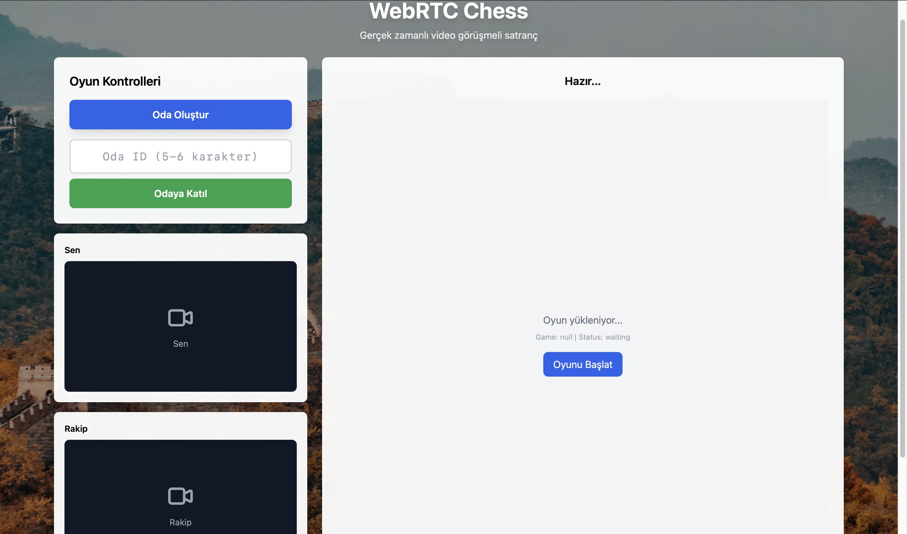
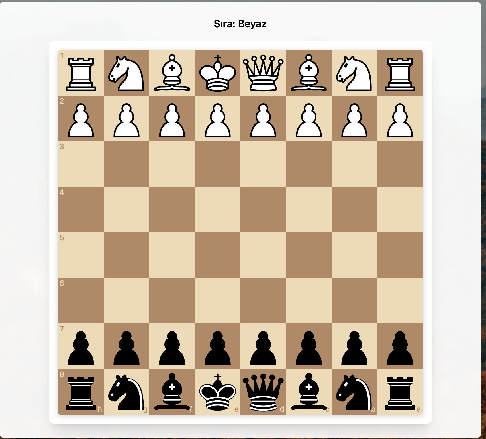
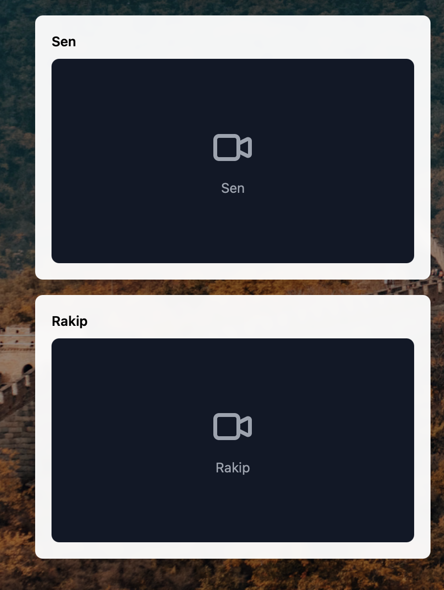

# 🎮 WebRTC Chess - Real-Time Video Chess Game

[](https://nextjs.org/)
[](https://www.typescriptlang.org/)
[](https://webrtc.org/)
[](https://firebase.google.com/)
[](LICENSE)

Modern, cutting-edge real-time chess game. Video chat with WebRTC and game synchronization with Firebase Firestore.

## 🚀 Live Demo

**[🎮 Live Demo - play-chess-now.vercel.app](https://play-chess-now.vercel.app)**

You can test it from two different devices or browsers!

## 📸 Screenshots

<div align="center">
  
  
  
</div>

## ✨ Features

- ✅ **Next.js 14** - Modern React framework with App Router
- ✅ **TypeScript** - Full type safety
- ✅ **WebRTC** - Real-time video chat and low-latency move transmission
- ✅ **Firebase Firestore** - Game state synchronization and persistence
- ✅ **React Chessboard** - Modern, responsive chess board
- ✅ **Tailwind CSS** - Modern, responsive UI
- ✅ **ExpressTurn.com TURN Server** - Free TURN server support
- ✅ **Error Handling** - Comprehensive error handling
- ✅ **Pawn Promotion** - Interactive promotion selection
- ✅ **Game Status** - Checkmate, stalemate, draw detection
- ✅ **Connection Status** - Connection status indicator

## 🚀 Quick Start

### 1. Install Dependencies

```bash
npm install
```

### 2. Create Environment Variables

Create a `.env.local` file and add the following variables:

```env
# Firebase Configuration
NEXT_PUBLIC_FIREBASE_API_KEY=your_api_key
NEXT_PUBLIC_FIREBASE_AUTH_DOMAIN=your_auth_domain
NEXT_PUBLIC_FIREBASE_PROJECT_ID=your_project_id
NEXT_PUBLIC_FIREBASE_STORAGE_BUCKET=your_storage_bucket
NEXT_PUBLIC_FIREBASE_MESSAGING_SENDER_ID=your_sender_id
NEXT_PUBLIC_FIREBASE_APP_ID=your_app_id

# ExpressTurn.com (Free TURN Server)
NEXT_PUBLIC_EXPRESSTURN_USERNAME=your_username
NEXT_PUBLIC_EXPRESSTURN_PASSWORD=your_password
NEXT_PUBLIC_EXPRESSTURN_SERVER=free.expressturn.com

# Metered TURN (Optional - Not needed if using ExpressTurn)
NEXT_PUBLIC_METERED_DOMAIN=your_domain.metered.live
NEXT_PUBLIC_METERED_SECRET_KEY=your_secret_key
```

### 3. Start Development Server

```bash
npm run dev
```

Open in browser: [http://localhost:3000](http://localhost:3000)

## 📖 Usage

1. **Create Room**: Click the "Create Room" button
2. **Share Room ID**: Share the generated room ID (5-6 characters) with your opponent
3. **Join Room**: Opponent enters the room ID and clicks "Join Room"
4. **Camera Permission**: Grant camera and microphone permissions
5. **Play**: Make moves and start playing!

## 🏗️ Project Structure

```
chessrtcmvp/
├── app/                    # Next.js App Router
│   ├── page.tsx           # Main page
│   ├── layout.tsx         # Root layout
│   └── globals.css        # Global styles
├── components/             # React components
│   ├── ChessBoard.tsx     # Chess board
│   ├── VideoStream.tsx    # Video stream display
│   └── ConnectionStatus.tsx # Connection status
├── hooks/                 # Custom React hooks
│   ├── useWebRTC.ts       # WebRTC management
│   ├── useChessGame.ts    # Game logic
│   └── useGameRoom.ts     # Room management
├── lib/                   # Helper functions
│   ├── firebase.ts        # Firebase configuration
│   ├── webrtc.ts          # WebRTC helpers
│   └── roomId.ts          # Room ID generation
├── types/                 # TypeScript types
│   └── game.ts            # Game types
└── public/                # Static files
    └── pieces/            # Chess piece images
```

## 🔧 Technical Details

### Architecture

- **Hooks Pattern**: State management with custom hooks
- **Component-based**: Reusable React components
- **Type Safety**: Full TypeScript support
- **Error Boundaries**: Comprehensive error handling

### WebRTC

- **STUN/TURN Servers**: Google STUN + ExpressTurn.com TURN (free)
- **Data Channel**: For fast move transmission
- **Firestore Backup**: For persistent game state

### Firebase

- **Real-time Sync**: Real-time synchronization with `onSnapshot`
- **Security Rules**: Open for MVP, add authentication for production
- **Persistence**: Game state and moves are stored in Firestore

## 🌐 Deployment

### Vercel Deployment

1. Go to Vercel Dashboard: https://vercel.com
2. Connect your GitHub repo
3. Add environment variables (from the list above)
4. Deploy!

Detailed guide: `VERCEL_DEPLOY.md`

### Firebase Setup

1. Create a project in Firebase Console
2. Create Firestore Database
3. Set Security Rules (open for MVP)
4. Add web app and get config information

Detailed guide: `FIREBASE_SETUP_GUIDE.md`

## 📝 Environment Variables

### Firebase (Required)

- `NEXT_PUBLIC_FIREBASE_API_KEY`
- `NEXT_PUBLIC_FIREBASE_AUTH_DOMAIN`
- `NEXT_PUBLIC_FIREBASE_PROJECT_ID`
- `NEXT_PUBLIC_FIREBASE_STORAGE_BUCKET`
- `NEXT_PUBLIC_FIREBASE_MESSAGING_SENDER_ID`
- `NEXT_PUBLIC_FIREBASE_APP_ID`

### TURN Server (Required - ExpressTurn or Metered)

**ExpressTurn.com (Recommended - Free):**
- `NEXT_PUBLIC_EXPRESSTURN_USERNAME`
- `NEXT_PUBLIC_EXPRESSTURN_PASSWORD`
- `NEXT_PUBLIC_EXPRESSTURN_SERVER` (default: `free.expressturn.com`)

**Metered TURN (Alternative):**
- `NEXT_PUBLIC_METERED_DOMAIN`
- `NEXT_PUBLIC_METERED_SECRET_KEY`

## 🎨 Chess Piece Images

Chess piece images are stored in the `public/pieces/` folder:

- `wK.png`, `wQ.png`, `wR.png`, `wB.png`, `wN.png`, `wP.png` (White pieces)
- `bK.png`, `bQ.png`, `bR.png`, `bB.png`, `bN.png`, `bP.png` (Black pieces)

**Note:** The `react-chessboard` library uses its own piece images. To use custom images, update the `ChessBoard.tsx` component.

## 🐛 Troubleshooting

### ICE Connection Stuck in "checking" State

- Make sure TURN server is working
- Check ExpressTurn credentials
- TURN server is required when testing from different networks

### Game Stuck in "Loading..." State

- Check console for `useChessGame: Initializing game...` log
- Click "Start Game" button (manual initialization)

### Firebase Connection Error

- Make sure environment variables are correct
- Make sure Firestore Security Rules are published
- Disable Brave Shields (ad blocker)

## 🎥 Demo Video Guide

Step-by-step guide for creating a demo video:

### 📋 Preparation

1. **Prepare two devices:**
   - Computer (for main screen recording)
   - Phone or second browser (for second player)

2. **Recording software:**
   - **Mac:** QuickTime Player (screen recording)
   - **Windows:** OBS Studio or Windows + G (Game Bar)
   - **Linux:** OBS Studio or SimpleScreenRecorder

3. **Test:**
   - Make sure you can access the site from both devices
   - Grant camera and microphone permissions

### 🎬 Video Content (30-60 seconds)

**Recommended timeline:**

- **0-5 seconds:** Main screen display (title, buttons)
- **5-15 seconds:** Click "Create Room" button, show room code
- **15-25 seconds:** Join from second device, establish video connection
- **25-45 seconds:** Chess game (show a few moves)
- **45-60 seconds:** Move synchronization (moves visible on both sides)

### 🎨 Video Quality

- **Resolution:** 1080p (1920x1080) or 720p (1280x720)
- **Format:** MP4 (H.264 codec)
- **Duration:** 30-60 seconds (short and concise)
- **Audio:** Optional (you can add music)

### 📤 Upload Options

1. **YouTube:**
   - Upload as unlisted
   - Add embed link to README

2. **GitHub:**
   - Add as `demo-video.mp4` in `public/` folder
   - Show as link in README

3. **Vimeo:**
   - Upload as unlisted
   - Add embed link

### 💡 Tips

- **Fast transitions:** Speed up slow parts (2x speed)
- **Zoom:** Zoom into important parts (room code, moves)
- **Add text:** Add short explanations on screen
- **Music:** Add background music (optional)

### 📝 Example Video Script

```
[0-5s] Main screen display
"WebRTC Chess - Real-time video chess game"

[5-10s] Create room
Click "Create Room" button → Room code: "ABC123"

[10-20s] Join from second device
Enter room code → "Join Room" → Video connection established

[20-40s] Play game
Make moves → Synchronized on both sides

[40-50s] Final screen
Connection status: "Connected" ✅
```

## 📚 Resources

- [Next.js Documentation](https://nextjs.org/docs)
- [WebRTC API](https://developer.mozilla.org/en-US/docs/Web/API/WebRTC_API)
- [Firebase Firestore](https://firebase.google.com/docs/firestore)
- [Chess.js](https://github.com/jhlywa/chess.js)
- [React Chessboard](https://github.com/Clariity/react-chessboard)
- [ExpressTurn.com](https://www.expressturn.com)

## 📄 License

This project is in MVP (Minimum Viable Product) stage.

## 🤝 Contributing

1. Fork the repository
2. Create a feature branch (`git checkout -b feature/amazing-feature`)
3. Commit your changes (`git commit -m 'Add amazing feature'`)
4. Push to the branch (`git push origin feature/amazing-feature`)
5. Open a Pull Request

---

**Note:** This project is not production-ready. Before going to production:
- Add Firebase Authentication
- Secure Security Rules
- Improve error handling
- Add rate limiting
- Add analytics
